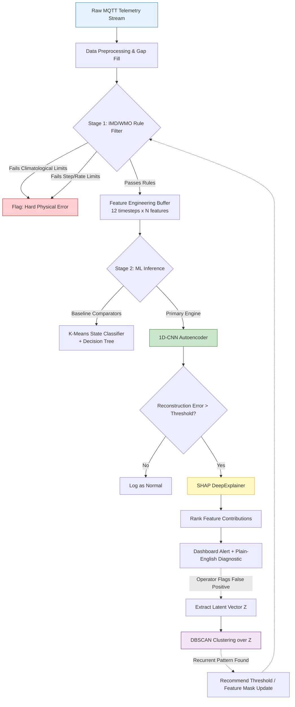
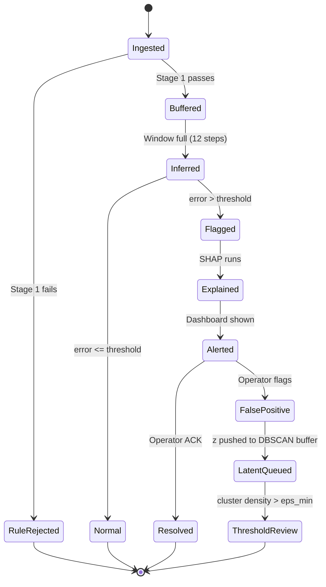
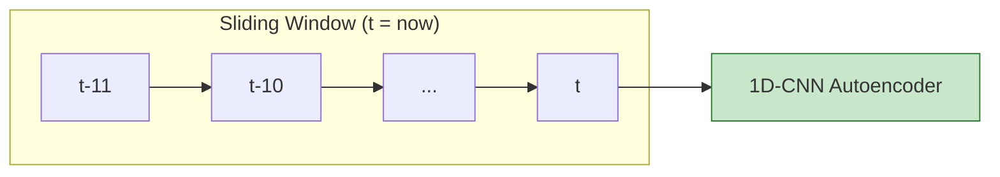
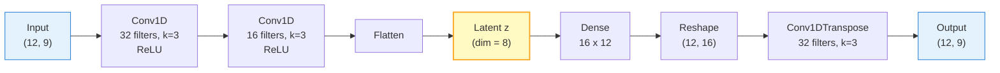
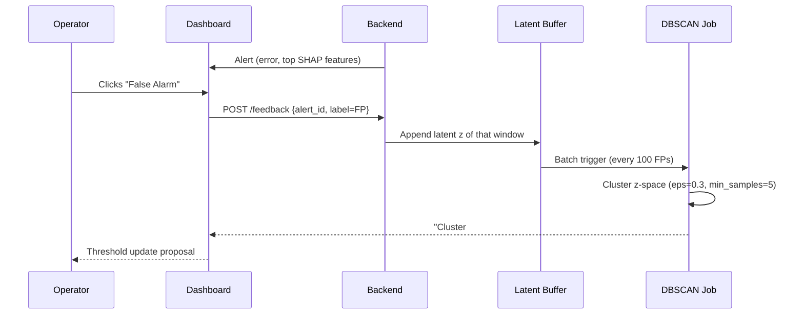
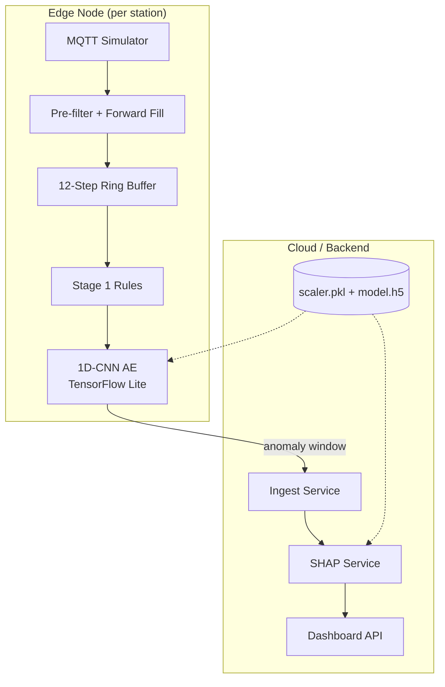
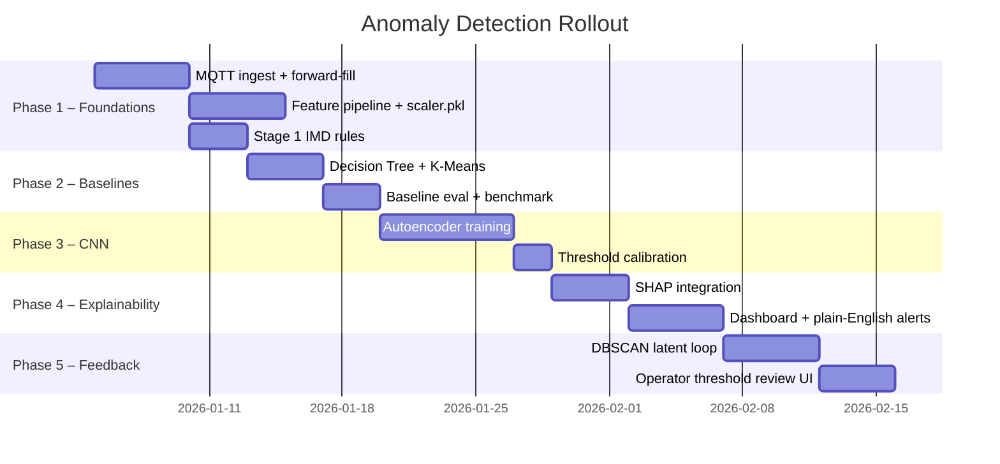

# End-to-End ML Pipeline for Sensor Anomaly Detection

**Project:** Real-Time IoT Weather Telemetry Anomaly Detection
**Stack:** MQTT Edge Simulator → Feature Buffer → Hybrid Rule + Deep Learning Engine → SHAP Explainability → Operator Feedback Loop
**Owner:** ML / Anomaly Detection Team
**Version:** 1.0 (Design Spec)

---

## Table of Contents

1. [Executive Summary](#1-executive-summary)
2. [System Architecture](#2-system-architecture)
3. [Data Preprocessing & Feature Engineering](#3-data-preprocessing--feature-engineering)
4. [Model Progression: Baseline → Deep Learning](#4-model-progression-baseline--deep-learning)
5. [Primary Engine: 1D-CNN Autoencoder](#5-primary-engine-1d-cnn-autoencoder)
6. [Explainability & Active Learning Loop](#6-explainability--active-learning-loop)
7. [Deployment Topology](#7-deployment-topology)
8. [Evaluation & Metrics](#8-evaluation--metrics)
9. [Implementation Roadmap](#9-implementation-roadmap)
10. [Appendix: Thresholds & Config Reference](#10-appendix-thresholds--config-reference)

---

## 1. Executive Summary

The pipeline ingests raw weather telemetry (Temperature, Humidity, Pressure, Wind, etc.) over MQTT and identifies two distinct classes of failure:

| Failure Class | Example | Detector |
|---|---|---|
| **Hard physical errors** | RH = 130%, ΔTemp = 8°C in 10 min | Stage 1 Rule Filter (deterministic) |
| **Soft / multivariate anomalies** | Sensor drift, cross-feature decoupling, sunrise-bias | Stage 2 1D-CNN Autoencoder |

The guiding design principle is **two-stage filtering**: cheap, deterministic rules eliminate obvious impossibilities so that the expensive neural inference and SHAP explanation budget is spent only on genuinely ambiguous windows. Every alert is explainable (SHAP), and every false positive is fed back into a DBSCAN clustering loop that recommends threshold and feature-mask updates to the operator.

---

## 2. System Architecture

### 2.1 High-Level Pipeline



### 2.2 Design Rationale

- **Stage 1 is free.** A few arithmetic comparisons reject ~70% of gross faults before any model runs.
- **Stage 2 is stateless per window.** The CNN evaluates 12-step windows; no global state is carried between inferences, which makes edge deployment trivial.
- **SHAP is gated.** It only runs on flagged windows, keeping compute under the 50 ms budget.
- **Feedback is asynchronous.** The DBSCAN loop runs as a background job — it never blocks the live alert path.

### 2.3 Alert Lifecycle State Machine



---

## 3. Data Preprocessing & Feature Engineering

### 3.1 Ingestion Assumptions

- **Sampling cadence:** 1 reading / 10 minutes per sensor node.
- **Transport:** MQTT topic per station, e.g. `weather/{station_id}/telemetry`.
- **Schema (raw):** `ts, station_id, T, RH, P, wind_speed, wind_dir, rainfall`.

### 3.2 Missing Packet Handling

The edge simulator may drop packets. To keep the CNN window intact:

```python
def forward_fill(packet, last_valid):
    if packet is None or packet.is_nan():
        return last_valid, drop_flag=True
    return packet, drop_flag=False
```

- **Forward-fill** the last valid reading, but **attach a `drop_flag` feature** so the autoencoder learns to expect imputed rows and doesn't flag them as anomalies.
- If more than **3 consecutive packets** are dropped, mark the window `stale` and skip inference — this is a connectivity alert, not a sensor anomaly.

### 3.3 Rolling Window Construction

Each inference consumes a **12-step rolling window** = **2 hours of history** at 10-minute resolution.

```
Input tensor shape: (batch_size, 12, num_features)
```



### 3.4 Feature Set

| # | Feature | Formula / Source | Purpose |
|---|---|---|---|
| 1 | `T` | raw | Temperature |
| 2 | `RH` | raw | Relative humidity |
| 3 | `P` | raw | Barometric pressure |
| 4 | `Td` | Magnus: `Td = (b·α)/(a−α)`, `α = ln(RH/100) + aT/(b+T)` | Dew point — physical consistency |
| 5 | `dT/dt` | `T[t] − T[t−1]` | Rate of change |
| 6 | `dP/dt` | `P[t] − P[t−1]` | Pressure tendency |
| 7 | `dRH/dt` | `RH[t] − RH[t−1]` | Humidity velocity |
| 8 | `ΔT_spatial` | `T_station − T_neighbor` | Spatial consistency |
| 9 | `drop_flag` | 0/1 | Marks forward-filled rows |

> **Why derivatives as explicit features?** CNNs are good at local pattern extraction but poor at signed differences across distant timesteps. Handing them `dT/dt` directly shortens the learning curve and makes SHAP attribution interpretable ("this alert was driven by dP/dt").

### 3.5 Scaling

Fit a **`RobustScaler`** (median + IQR) on the **normal baseline dataset only**.

```python
from sklearn.preprocessing import RobustScaler
scaler = RobustScaler().fit(normal_baseline_df[FEATURES])
joblib.dump(scaler, "gs://weather-anomaly/artifacts/scaler.pkl")
```

- RobustScaler is chosen because weather has heavy-tailed extremes; standard z-scoring would compress the very anomalies we want to detect.
- **Never refit on production data** — that would silently drift the model's notion of "normal."

---

## 4. Model Progression: Baseline → Deep Learning

> **Principle:** Ship a working MVP on day one, and create a mathematical benchmark that justifies the CNN.

### 4.1 Stage 1 — IMD/WMO Hard Rules (Day 1)

Deterministic, explainable, zero-cost. Implemented as a rule table loaded from config.

| Check | Threshold | Action |
|---|---|---|
| RH physical bound | `RH > 100%` or `RH < 0%` | Hard error |
| Temp step | `|ΔT| > 0.3 °C / 10 min` | Hard error |
| RH step | `|ΔRH| > 3 % / 10 min` | Hard error |
| Pressure step | `|ΔP| > 0.3 hPa / 10 min` | Hard error |
| Temp spike | `ΔT > 5 °C / 10 min` | Hard error |
| Dew point sanity | `Td > T + 0.5` | Hard error (supersaturation) |
| Frozen range | `RH == 0` for > 30 min | Stuck-sensor flag |

```python
def stage1_rules(window, cfg):
    last, prev = window[-1], window[-2]
    if not (0 <= last.RH <= 100):
        return "HARD_RH_BOUND"
    if abs(last.T - prev.T) > cfg.DT_STEP:
        return "HARD_T_STEP"
    if abs(last.P - prev.P) > cfg.DP_STEP:
        return "HARD_P_STEP"
    if last.Td > last.T + 0.5:
        return "HARD_SUPERSATURATION"
    return None
```

### 4.2 Stage 1.5 — Baseline ML Comparators

| Model | Role | Why |
|---|---|---|
| **Decision Tree** (depth ≤ 4) | Catches simple threshold breaches missed by rules | Fully interpretable, gives a benchmark F1 |
| **K-Means (k=6)** | Defines distinct "normal weather states" (clear day, rain, fog, front passage, etc.) | Distance-to-centroid becomes a cheap anomaly score |

These do **not** replace the CNN. They provide:
1. A **fallback** if the CNN is offline.
2. A **lower bound** on performance — the CNN must beat them to justify its complexity.

### 4.3 Stage 2 — Primary 1D-CNN Autoencoder

See [Section 5](#5-primary-engine-1d-cnn-autoencoder).

### 4.4 Model Comparison Matrix

| Model | Latency | Explainability | Multivariate? | Deploy Stage |
|---|---|---|---|---|
| IMD Rules | < 1 ms | Native | No | Edge |
| Decision Tree | < 5 ms | Native (tree paths) | Limited | Edge |
| K-Means | < 10 ms | Moderate (centroid distance) | Yes | Edge |
| **1D-CNN AE** | **~30 ms** | **SHAP** | **Yes** | **Edge / Cloud** |
| SHAP | ~50 ms | Native (attribution) | Yes | Cloud (gated) |

---

## 5. Primary Engine: 1D-CNN Autoencoder

### 5.1 Architecture



### 5.2 Design Choices

| Layer | Choice | Rationale |
|---|---|---|
| Conv1D × 2 | 32 → 16 filters, kernel 3 | Sliding over 12 timesteps captures 2-hour context |
| Latent dim = 8 | Bottleneck | Forces compression; too large → memorizes anomalies, too small → underfits normal variance |
| Loss | MSE on normal data | Standard AE objective |
| Optimizer | Adam, lr = 1e-3 | Standard |
| Epochs | 50 with early stopping (patience 5) | Prevent overfit on normal-only data |
| Validation split | 10% of normal set | Early stopping criterion |

### 5.3 Training Loop (Pseudocode)

```python
model = CNN1DAutoencoder(window=12, n_features=9, latent_dim=8)
model.compile(optimizer="adam", loss="mse")

history = model.fit(
    X_normal_train, X_normal_train,       # AE reconstructs its own input
    validation_split=0.1,
    epochs=50,
    batch_size=64,
    callbacks=[EarlyStopping(patience=5, restore_best_weights=True)]
)
```

### 5.4 Inference & Scoring

```python
recon = model.predict(window[None, ...])         # (1, 12, 9)
error = np.mean((window - recon[0]) ** 2)        # scalar MSE

if error > THRESHOLD:
    trigger_shap(window)
else:
    log_normal(window, error)
```

### 5.5 Threshold Selection

Do **not** hard-code the threshold. Set it from the **normal-set error distribution**:

```python
normal_errors = [recon_error(w) for w in normal_val_windows]
THRESHOLD = np.quantile(normal_errors, 0.995)   # 99.5th percentile
```

This guarantees a ~0.5% false-positive rate on clean data by construction and gives operators a principled knob to tune later.

---

## 6. Explainability & Active Learning Loop

### 6.1 SHAP-Based Diagnostics

When `error > THRESHOLD`, we ask *which feature and which timestep* drove the reconstruction failure.

```python
explainer = shap.GradientExplainer(model, background=normal_sample_50)
shap_values = explainer.shap_values(window[None, ...])   # (1, 12, 9)
```

- **Background sample size = 50** representative normal windows → keeps SHAP under 50 ms.
- Aggregate `|shap|` per feature across the 12 timesteps to get a ranked contribution vector.

```python
contrib = np.abs(shap_values[0]).sum(axis=0)   # per-feature importance
top_feature = FEATURES[np.argmax(contrib)]
```

### 6.2 Plain-English Mapping

| Top SHAP Feature | Frontend Message |
|---|---|
| `RH` | "Humidity sensor indicated as damaged — inconsistent with temperature history." |
| `dP/dt` | "Abnormal pressure drop rate detected — possible sensor drift or front." |
| `Td` | "Dew point physically inconsistent with temperature reading." |
| `ΔT_spatial` | "Station deviates from neighboring station by more than expected." |
| `drop_flag` | "High packet loss in window — alert may be a connectivity artifact." |

### 6.3 The Feedback Loop (Operator-in-the-Loop)



### 6.4 Why DBSCAN on the Latent Space?

- False positives often **cluster** in `z`-space (e.g., every sunrise creates a similar multivariate pattern the autoencoder never saw).
- **DBSCAN** is chosen over k-means because the number of clusters is unknown and we want to identify *density* — outliers (one-off FPs) are naturally excluded as noise (`label = -1`).
- When a dense cluster of FPs is found, the system **recommends** — never auto-applies — a threshold or feature-mask update. The operator retains authority.

### 6.5 Feedback Loop Parameters

| Parameter | Value | Notes |
|---|---|---|
| Latent buffer size | 1000 | Rolling |
| DBSCAN `eps` | 0.3 | Tuned on baseline z-spread |
| DBSCAN `min_samples` | 5 | Minimum cluster to be meaningful |
| Recommendation trigger | Cluster size ≥ 5 | Avoids knee-jerk changes |

---

## 7. Deployment Topology



- **Edge:** Rules + CNN run locally → sub-50 ms latency, works offline.
- **Cloud:** SHAP + dashboard + DBSCAN feedback run server-side (heavier compute, non-blocking).
- **Artifacts:** Model and scaler stored in a cloud bucket with versioned paths (`v1.0/scaler.pkl`).

---

## 8. Evaluation & Metrics

| Metric | Target | Why |
|---|---|---|
| **Precision @ top-K alerts** | ≥ 0.85 | Operators lose trust if alerts are noisy |
| **Recall on injected faults** | ≥ 0.95 | Missing a stuck sensor is costly |
| **False-positive rate (normal set)** | ≤ 0.5% | By construction (99.5th percentile threshold) |
| **Mean time-to-detect** | ≤ 30 min (3 windows) | SLA for sensor drift |
| **CNN latency (edge)** | ≤ 40 ms | Real-time |
| **SHAP latency (cloud)** | ≤ 50 ms | Interactive dashboard |

### Fault Injection Test Set

Create a synthetic test set with known anomalies:

- **Drift:** gradually bias `T` by +0.1 °C per step.
- **Stuck:** freeze `RH` at last valid value for 6 hours.
- **Spike:** single-step `T += 6 °C`.
- **Decoupling:** `RH += 20%` while `T` unchanged.
- **Dropout:** 40% missing packets for 1 hour.

Report a confusion matrix per fault type.

---

## 9. Implementation Roadmap



### Phase Gates

| Phase | Exit Criteria |
|---|---|
| 1 | ≥ 1 day of clean data flowing end-to-end |
| 2 | Baseline F1 reported; CNN benchmark defined |
| 3 | CNN beats baseline on injected fault recall by ≥ 5% |
| 4 | SHAP < 50 ms; alerts readable by non-ML operator |
| 5 | DBSCAN produces ≥ 1 actionable recommendation on real FP data |

---

## 10. Appendix: Thresholds & Config Reference

```yaml
# config/anomaly.yaml
stage1:
  rh_min: 0
  rh_max: 100
  dt_step: 0.3          # °C per 10 min
  drh_step: 3.0         # % per 10 min
  dp_step: 0.3          # hPa per 10 min
  dt_spike: 5.0         # °C per 10 min
  stale_consecutive: 3  # packets

window:
  length: 12
  cadence_minutes: 10

features:
  - T
  - RH
  - P
  - Td
  - dT_dt
  - dP_dt
  - dRH_dt
  - dT_spatial
  - drop_flag

model:
  latent_dim: 8
  conv_filters: [32, 16]
  kernel_size: 3
  epochs: 50
  batch_size: 64
  early_stop_patience: 5

threshold:
  strategy: quantile
  quantile: 0.995
  fallback_value: 0.0042

shap:
  background_samples: 50
  explainer: GradientExplainer

dbscan:
  eps: 0.3
  min_samples: 5
  buffer_size: 1000

artifacts:
  scaler_uri: "gs://weather-anomaly/artifacts/scaler.pkl"
  model_uri:  "gs://weather-anomaly/artifacts/cnn_ae_v1.h5"
```

---

## Closing Notes

This design deliberately **separates concerns**:

- **Rules** handle the physically impossible — cheap, deterministic, auditable.
- **Baselines** provide a safety net and a benchmark.
- **The CNN** handles multivariate, temporal anomalies that no rule can express.
- **SHAP** converts the CNN's black box into operator-readable diagnostics.
- **DBSCAN** closes the loop, letting the system *learn from its own mistakes* without ever silently changing its own thresholds.

The result is a pipeline that is fast enough for the edge, explainable enough for operators, and honest enough to admit when it's wrong.