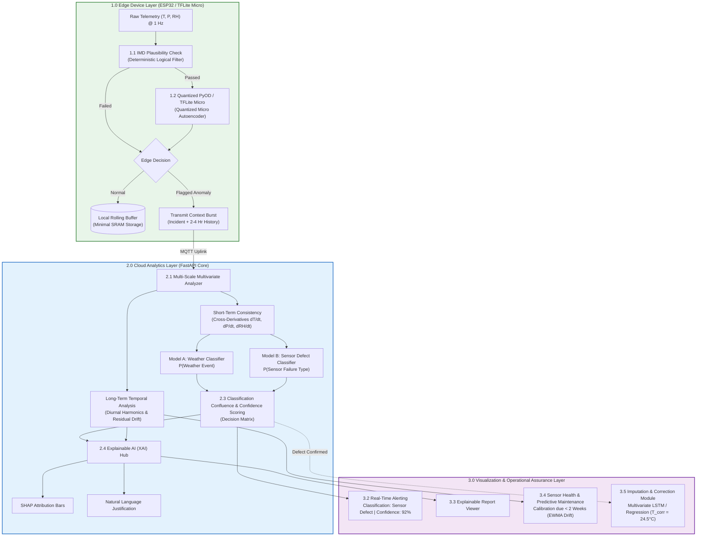

# End-to-End ML Strategy: Split-Edge/Cloud Anomaly Detection & Telemetry Quality Assurance

**Project:** SkyGuard AI — Automatic Weather Station (AWS) Telemetry Integrity  
**Stack:** ESP32 Edge (TFLite Micro / PyOD) ➔ MQTT Context Burst ➔ Cloud FastAPI ➔ Multi-Scale Analyzer ➔ Dual-Model Confluence (Weather vs. Defect) ➔ SHAP XAI Hub ➔ Predictive Maintenance & Imputation  
**Version:** 2.0 (Design & Machine Learning Specification)  
**Status:** Approved for Build  

---

## Table of Contents

1. [Executive Summary & Core Principles](#1-executive-summary--core-principles)
2. [End-to-End ML Pipeline Architecture](#2-end-to-end-ml-pipeline-architecture)
3. [Edge Device Layer (1.0 — ESP32 Deployment)](#3-edge-device-layer-10--esp32-deployment)
4. [Cloud Analytics Layer (2.0 — Deep Multi-Scale Reasoning)](#4-cloud-analytics-layer-20--deep-multi-scale-reasoning)
5. [Dual-Model Classification & Reasoning (Model A vs. Model B)](#5-dual-model-classification--reasoning-model-a-vs-model-b)
6. [Synthetic Fault Injection Methodology for Model B](#6-synthetic-fault-injection-methodology-for-model-b)
7. [Classification Confluence & Confidence Scoring](#7-classification-confluence--confidence-scoring)
8. [Explainable AI (XAI) Hub & Text Justification](#8-explainable-ai-xai-hub--text-justification)
9. [Long-Term Drift Monitoring & Predictive Maintenance (3.4)](#9-long-term-drift-monitoring--predictive-maintenance-34)
10. [Imputation & Correction Module (3.5)](#10-imputation--correction-module-35)
11. [Evaluation Metrics & Benchmark Targets](#11-evaluation-metrics--benchmark-targets)
12. [Configuration Reference (`config/ml_pipeline.yaml`)](#12-configuration-reference-configml_pipelineyaml)

---

## 1. Executive Summary & Core Principles

Conventional Automatic Weather Station (AWS) monitoring fails in real-world deployments because static IMD single-parameter limits cannot detect subtle physical degradations (such as slow capacitive drift or cross-channel decoupling), while pure cloud deep learning saturates low-bandwidth cellular/satellite uplinks.

SkyGuard AI's Machine Learning Strategy addresses these realities through **four key pillars**:

| Pillar | Rationale & Implementation |
|---|---|
| **Split-Architecture Deployment** | Full LLM or heavy deep learning models cannot run on an ESP32 due to RAM/Flash limits. The system deploys a quantized, minimalist model on the Edge for instant filtering, transmitting context-rich packet bursts to the Cloud only upon anomaly detection. |
| **Dual-Model Structured Reasoning** | Replaces unstructured LLM agent chats with a deterministic **Classification Confluence Matrix** driven by two specialized classifiers: **Model A (Weather Classifier)** and **Model B (Sensor Defect Classifier)**. |
| **Synthetic Defect Generation** | Because real-world sensor defect datasets with diverse failure modes do not exist, Model B is rigorously trained using mathematically formulated synthetic fault injection (frozen flatlines, spikes, drift, Gaussian noise, dropouts) layered onto clean IMD weather baselines. |
| **Full Lifecycle Assurance** | Goes beyond detection to provide **Explainable AI (SHAP)**, **Predictive Maintenance** (forecasting calibration deadlines from cumulative drift), and **Automated Imputation** (reconstructing damaged readings from healthy correlated sensors). |

---

## 2. End-to-End ML Pipeline Architecture



---

## 3. Edge Device Layer (1.0 — ESP32 Deployment)

### 3.1 1.1 IMD Plausibility Check (Logical Filter)
- **Role**: Zero-cost, instantaneous boundary enforcement executing in $< 0.1\,\text{ms}$ on an ESP32 CPU.
- **Ruleset**:
  - Climatological Absolute Limits: $-5^\circ\text{C} \le T \le 55^\circ\text{C}$, $0\% \le RH \le 100\%$, $900\,\text{hPa} \le P \le 1060\,\text{hPa}$.
  - Thermodynamic Dew Point Sanity: $T_d = \frac{b \cdot \alpha}{a - \alpha} \le T + 0.5^\circ\text{C}$ (where $\alpha = \ln(RH/100) + \frac{aT}{b+T}$, $a=17.27, b=237.7$).
  - Instantaneous Step Limits: $|\Delta T| \le 5.0^\circ\text{C} / \text{10 min}$, $|\Delta RH| \le 20.0\% / \text{10 min}$, $|\Delta P| \le 3.5\,\text{hPa} / \text{10 min}$.

### 3.2 1.2 Quantized PyOD (Lightweight Outlier Detection)
- **Model**: Quantized INT8 Autoencoder or Elliptic Envelope trained on normal 3-parameter ($T, P, RH$) 12-sample sliding windows.
- **Hardware Footprint**: Model size $< 95\,\text{KB}$, RAM consumption $< 48\,\text{KB}$ SRAM, inference latency $< 15\,\text{ms}$ on ESP32 at 240 MHz.
- **Scoring**:
  $$\text{Reconstruction Error } (E) = \frac{1}{12 \times 3} \sum_{t=1}^{12} \sum_{i \in \{T, P, RH\}} (x_{t,i} - \hat{x}_{t,i})^2$$
  If $E > \tau_{\text{edge}}$ (where $\tau_{\text{edge}}$ is calibrated to the 99.0th percentile of normal training validation error), the window is flagged.

### 3.3 1.3 Edge Decision & Context Transmission
- **Normal Telemetry**: Appended to a circular flash/SRAM buffer; a compressed heartbeat is emitted at low cadence (every 10–15 minutes).
- **Flagged Telemetry**: Triggers an immediate MQTT **Incident Packet** containing the anomalous reading, the trigger flag, and the preceding 2 to 4 hours of uncorrupted historical sliding buffer to provide full context for cloud evaluation.

---

## 4. Cloud Analytics Layer (2.0 — Deep Multi-Scale Reasoning)

### 4.1 2.1 Multi-Scale Multivariate Analyzer
Flagged context packets arriving at the cloud are processed across two complementary time horizons:

1. **Short-Term Multivariate Consistency (12 Timesteps = 2 Hours)**:
   - Computes first and second numerical derivatives: $dT/dt$, $dP/dt$, $dRH/dt$, $d^2P/dt^2$.
   - Computes thermodynamic coupling:
     $$\text{Coupling Coefficient } \rho_{T,RH} = \text{Corr}(T_{[t-11:t]}, RH_{[t-11:t]})$$
     In physical atmospheres, $T$ and $RH$ are strongly anti-correlated ($\rho < -0.6$). Decoupling where $\rho \to 0$ or $\rho > 0$ during non-condensing periods strongly indicates transducer failure.
2. **Long-Term Temporal/Seasonal Analysis (7–30 Days)**:
   - Performs harmonic decomposition of the diurnal solar cycle.
   - Compares current baseline against regional climatological expectations and spatial neighbor stations to establish baseline residual error.

---

## 5. Dual-Model Classification & Reasoning (Model A vs. Model B)

Rather than using an unstructured conversation between LLMs, the system employs two specialized supervised classifiers evaluated via a structured Confluence Decision Matrix.

```
Incoming Multivariate Context Tensor (12 x 9 Features)
                  │
        ┌─────────┴─────────┐
        ▼                   ▼
┌──────────────────┐ ┌──────────────────┐
│     Model A      │ │     Model B      │
│Weather Classifier│ │ Defect Classifier│
└────────┬─────────┘ └────────┬─────────┘
         │ P(Weather)         │ P(Defect)
         └─────────┬──────────┘
                   ▼
┌──────────────────────────────────────┐
│  2.3 Classification Confluence &     │
│       Confidence Scoring Matrix      │
└──────────────────┬───────────────────┘
                   ▼
┌──────────────────────────────────────┐
│   Final Status + Confidence Score    │
└──────────────────────────────────────┘
```

### 5.1 Model A: Weather Classifier
- **Architecture**: Gradient Boosted Trees (LightGBM) or 1D-CNN.
- **Target Classes**: `[NOMINAL_DIURNAL, SQUALL_LINE, SEVERE_THUNDERSTORM, HEATWAVE, RADIATION_FOG, COLD_FRONT]`.
- **Training Source**: Clean historical IMD observations containing verified meteorological events.
- **Key Signal**: Correlated multi-sensor dynamics (e.g., sharp pressure drop synchronized with sudden wind increase, rapid cooling, and humidity spike).
- **Primary Output**: $P(\text{Weather}) \in [0.0, 1.0]$.

### 5.2 Model B: Sensor Defect Classifier
- **Architecture**: Specialized Multi-Class Classifier (LightGBM / 1D-CNN).
- **Target Classes**: `[NO_DEFECT, FROZEN_VALUE, IMPULSE_SPIKE, NOISE_BURST, CALIBRATION_DRIFT, PACKET_DROPOUT]`.
- **Training Strategy**: Trained on clean data with **mathematically injected synthetic fault signatures** (see Section 6).
- **Key Signal**: Uncorrelated single-channel anomalies, unnatural derivative flatlines, or high-frequency variance lacking thermodynamic backing.
- **Primary Output**: $P(\text{Defect}) \in [0.0, 1.0]$ and predicted fault archetype.

---

## 6. Synthetic Fault Injection Methodology for Model B

Because true operational weather station defect logs with comprehensive multi-channel failure ground truth are practically non-existent, Model B is trained by superimposing synthetic failure patterns onto clean weather series $x_i(t)$:

```python
# Mathematical formulations for synthetic defect injection
```

### 6.1 Frozen / Flatline Defect (`FROZEN_VALUE`)
Simulates an ADC freeze or mechanical sensor hang where the channel remains locked at value $c$:
$$x_{\text{frozen}}(t) = x(t_{\text{freeze}}), \quad \forall t \in [t_{\text{freeze}}, t_{\text{freeze}} + \Delta t]$$
- **Characteristics**: $d x / dt \equiv 0$ across $\ge 6$ timesteps while correlated parameters undergo natural diurnal fluctuation.

### 6.2 Impulse Spike Defect (`IMPULSE_SPIKE`)
Simulates voltage transients, EMI, or electrostatic discharge:
$$x_{\text{spike}}(t) = x(t) + \delta \cdot \text{sgn}(\xi), \quad \delta \sim \mathcal{U}(3\sigma_i, 6\sigma_i)$$
- **Characteristics**: Extreme 1–2 step excursion with immediate return to baseline; physically impossible acceleration $d^2 x / dt^2$.

### 6.3 Gaussian Noise Burst (`NOISE_BURST`)
Simulates degraded wire connections, water ingress, or loose terminal grounding:
$$x_{\text{noisy}}(t) = x(t) + \epsilon(t), \quad \epsilon(t) \sim \mathcal{N}(0, \sigma_{\text{fault}}^2), \quad \sigma_{\text{fault}} = 3 \times \sigma_{\text{nominal}}$$
- **Characteristics**: Abnormal high-frequency spectral energy on a single sensor channel with zero coherence on neighboring channels.

### 6.4 Capacitive Calibration Drift (`CALIBRATION_DRIFT`)
Simulates polymer degradation or dust deposition in humidity/temperature sensors:
$$x_{\text{drift}}(t) = x(t) + \beta \cdot (t - t_0)$$
where $\beta \in [\pm 0.05, \pm 0.25]^\circ\text{C}/\text{day}$ or $[\pm 0.5, \pm 2.0]\%\,\text{RH}/\text{day}$.
- **Characteristics**: Cumulative divergence from diurnal harmonic baselines and spatial neighbor expectations.

### 6.5 Intermittent Packet Dropout (`PACKET_DROPOUT`)
Simulates failing radio transmission or bus collision:
$$x_{\text{drop}}(t) = \text{NaN} \quad (\text{forward-filled with } \text{drop\_flag} = 1)$$

---

## 7. Classification Confluence & Confidence Scoring

The Confluence Engine deterministically reconciles Model A and Model B predictions into an actionable decision:

| Model A: $P(\text{Weather})$ | Model B: $P(\text{Defect})$ | Final System Classification | Severity | Dashboard Action |
|---|---|---|---|---|
| $\ge 0.70$ | $< 0.30$ | **Natural Weather Event** | Nominal | Suppress alert; mark true-negative storm event |
| $< 0.30$ | $\ge 0.70$ | **Sensor Defect** | High / Critical | Fire alarm, trigger SHAP, launch Imputation |
| $\ge 0.70$ | $\ge 0.70$ | **Compound Weather + Sensor Anomaly** | Warning | Raise warning: extreme weather suspected to have damaged sensor |
| $< 0.30$ | $< 0.30$ | **Uncertain / Ambiguous Anomaly** | Low / Info | Queue for operator active-learning triage |

### Confidence Scoring Mathematical Formulation

$$\text{Confidence} = \max\left(P(\text{Defect}), P(\text{Weather})\right) \times \left[ 1.0 - 0.25 \times \left(1.0 - |P(\text{Defect}) - P(\text{Weather})|\right) \right]$$

- If both models are decisive and disagree (e.g., $P(\text{Defect}) = 0.95$ and $P(\text{Weather}) = 0.05$), the confluence penalty is minimal, yielding **Confidence = 92.6%**.
- If both models are uncertain (e.g., $P(\text{Defect}) = 0.52$ and $P(\text{Weather}) = 0.48$), the penalty reduces confidence to **Confidence = 39.5%**, preventing unwarranted high-severity alerts.

---

## 8. Explainable AI (XAI) Hub & Text Justification

The XAI Hub eliminates "black box" distrust by presenting operators with mathematical attributions and clear natural-language justifications:

### 8.1 SHAP Attribution Computation
- **Method**: TreeExplainer (for GBDT) or GradientExplainer (for 1D-CNN) pre-fitted with 50 background normal reference windows.
- **Latency**: Gated execution, running only on flagged confluence events ($< 35\,\text{ms}$).
- **Output**: Relative percentage contributions across features:
  $$C_i = \frac{\sum_{t=1}^{12} |\phi_{t,i}|}{\sum_{j} \sum_{t=1}^{12} |\phi_{t,j}|} \times 100\%$$

### 8.2 Natural Language Justification Generator
Rules combine the winning model, top SHAP features, and physical invariants into human-readable text:
> *"Model B detected a FROZEN_VALUE defect on Relative Humidity with 94.2% confidence. RH remained locked at 88.0% for 3.5 consecutive hours while ambient temperature rose by 7.4°C. Model A confirms weather-induced invariance is highly improbable (P(Weather) = 0.04). Top SHAP contributor: Relative Humidity (78.4%)."*

---

## 9. Long-Term Drift Monitoring & Predictive Maintenance (3.4)

To fulfill Objective 6 (predicting maintenance before catastrophic failure occurs):

### 9.1 Residual Tracking via EWMA
For each sensor channel $i$, calculate daily residual bias $r_i(d)$ against diurnal harmonic models and spatial neighbors:
$$r_i(d) = \frac{1}{144} \sum_{t=1}^{144} \left( x_{i}(t) - x_{i,\text{expected}}(t) \right)$$
Update the Exponentially Weighted Moving Average:
$$\text{EWMA}_i(d) = \lambda \cdot r_i(d) + (1 - \lambda) \cdot \text{EWMA}_i(d-1), \quad \lambda = 0.2$$

### 9.2 Predictive Maintenance Forecasting
When cumulative drift $|\text{EWMA}_i(d)|$ breaches the warning boundary $\tau_{\text{warn}} = 2.0\sigma$:
1. Sensor status transitions to **"At Risk"**.
2. Projected days until calibration deadline $\tau_{\text{fail}} = 3.5\sigma$:
   $$\text{Days to Recalibration} = \max\left(1, \left\lfloor \frac{\tau_{\text{fail}} - |\text{EWMA}_i(d)|}{|d\,\text{EWMA}_i / dt|} \right\rfloor\right)$$
3. The dashboard alerts operators: *"Pressure Sensor Calibration due in < 2 Weeks (projected 11 days remaining)."*

---

## 10. Imputation & Correction Module (3.5)

When Model B and the Confluence Matrix confirm a sensor defect, the system prevents data loss in downstream numerical weather prediction models by estimating the missing or corrupted parameter.

### 10.1 Model Architecture & Formulation
- **Model**: Multivariate Bidirectional LSTM or ElasticNet / Ridge Regression.
- **Input Vector**: Surviving healthy channels $x_{j \ne \text{faulty}}(t)$, temporal features (hour, solar elevation angle), and recent uncorrupted history:
  $$\hat{x}_{\text{faulty}}(t) = f_{\text{impute}}\left(\{ x_{j}(t) \}_{j \ne \text{faulty}}, \sin(\omega t), \cos(\omega t), \mathbf{x}_{t-1}\right)$$
- **Output**: Continuous suggested replacement value with a $95\%$ prediction interval:
  $$\text{Observed } T_{\text{faulty}} = 38.0^\circ\text{C} \quad \Longrightarrow \quad \text{Imputed } \hat{T} = 26.2^\circ\text{C} \pm 0.8^\circ\text{C}$$
- **Operator Control**: Displayed on the dashboard with an "Accept & Impute" button, logging both raw corrupted telemetry and calibrated imputed data in Supabase.

---

## 11. Evaluation Metrics & Benchmark Targets

| Metric | Target | Rationale |
|---|---|---|
| **Edge Quantized Model Size** | $< 120\,\text{KB}$ | Fits comfortably in ESP32 Flash partition |
| **Edge Inference Latency** | $< 20\,\text{ms}$ | Maintains 1 Hz real-time edge processing without task starvation |
| **Model A Recall (Severe Weather)** | $\ge 96.0\%$ | Eliminates false alarms on true storms |
| **Model B Precision (Injected Faults)** | $\ge 94.0\%$ | Prevents unnecessary technician dispatches |
| **Confluence F1-Score** | $\ge 0.92$ | Holistic accuracy across complex scenarios |
| **False Alarm Rate Reduction** | $\ge 85.0\%$ | Dramatic improvement over static threshold baselines |
| **Imputation Mean Absolute Error (MAE)** | $T \le 0.6^\circ\text{C}$, $RH \le 4.5\%$, $P \le 0.8\,\text{hPa}$ | Sufficient fidelity for numerical weather ingestion |

---

## 12. Configuration Reference (`config/ml_pipeline.yaml`)

```yaml
edge_layer:
  target: "ESP32-S3"
  model_type: "tflite_micro_autoencoder_int8"
  window_size: 12
  quantized_threshold: 0.038
  limits:
    temp_min: -5.0
    temp_max: 55.0
    rh_min: 0.0
    rh_max: 100.0
    pressure_min: 900.0
    pressure_max: 1060.0
    max_temp_rate_10min: 5.0
    max_rh_rate_10min: 20.0
    max_pressure_rate_10min: 3.5

cloud_analytics:
  multi_scale:
    short_term_steps: 12
    long_term_days: 14
  model_a:
    type: "lightgbm_weather_classifier"
    high_confidence_threshold: 0.70
    low_confidence_threshold: 0.30
  model_b:
    type: "lightgbm_defect_classifier"
    high_confidence_threshold: 0.70
    low_confidence_threshold: 0.30
    synthetic_faults:
      - frozen_value
      - impulse_spike
      - noise_burst
      - capacitive_drift
      - packet_dropout
  confluence:
    agreement_bonus: 1.0
    disagreement_penalty_factor: 0.25
  xai:
    explainer: "tree_shap"
    background_samples: 50
  predictive_maintenance:
    ewma_lambda: 0.2
    warning_sigma: 2.0
    critical_sigma: 3.5
  imputation:
    model: "multivariate_lstm_regressor"
    confidence_interval: 0.95
```