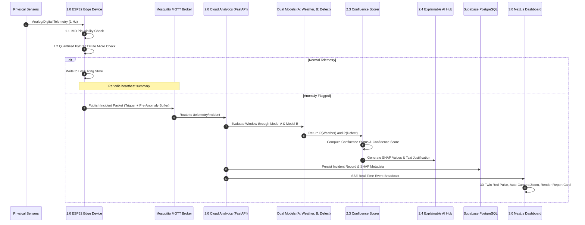

# SkyGuard AI MVP: Minimum User Flows & Operational Journeys

This document outlines the core user and system flows for the **SkyGuard AI Split-Edge/Cloud Anomaly Detection Architecture**.

---

## 1. Primary Flow: Edge Filtering, Confluence Reasoning, & XAI Diagnostics

This continuous loop moves telemetry from sensory acquisition on the edge node to cloud triage and operator visualization.

1. **Sensory Acquisition (1.0 Edge Device)**:
   The physical ESP32 (or Python edge simulator) polls temperature, pressure, and relative humidity at 1 Hz.
2. **Layer 1.1 IMD Plausibility Check**:
   The edge firmware executes zero-latency boundary rules (e.g., rejecting $T < 0^\circ\text{C}$ in Agra in May). If violated, an immediate rule flag is triggered.
3. **Layer 1.2 Quantized PyOD Outlier Detection**:
   If boundaries pass, the 12-timestep sliding window is evaluated by the INT8 Quantized Autoencoder (TFLite Micro). If reconstruction error is normal, data is saved to local ring storage.
4. **Layer 1.3 Context Burst Transmission**:
   If an anomaly is detected, the edge transmits an MQTT **Incident Packet** containing the trigger reading along with a 2–4 hour pre-anomaly contextual buffer.
5. **Layer 2.1 Multi-Scale Analysis**:
   The cloud backend parses short-term multivariate consistency ($dT/dt, dP/dt, dRH/dt$) and long-term seasonal baselines.
6. **Layer 2.2 Dual-Model Inference**:
   - **Model A (Weather Classifier)** evaluates probability of natural storm phenomena: $P(\text{Weather})$.
   - **Model B (Sensor Defect Classifier)** (trained on synthetically injected faults) evaluates probability of hardware failure: $P(\text{Defect})$.
7. **Layer 2.3 Classification Confluence & Confidence Scoring**:
   The Confluence Decision Matrix fuses both predictions into a definitive classification (e.g., "Sensor Defect") and calculates an exact confidence score (e.g., 92.4%).
8. **Layer 2.4 Explainable AI (XAI) Hub**:
   The system computes per-sensor SHAP importance percentages and generates a plain-English text justification.
9. **Layer 3.0 Dashboard Visualization**:
   The Next.js 3D Digital Twin pulses red, the camera automatically glides and zooms into the culprit sensor shield, and the Explainable Report Viewer renders the diagnostic breakdown.

### Primary Sequence Diagram

---

## 2. Secondary Flow: Predictive Maintenance & Sensor Health (3.4)

This flow shifts AWS operations from reactive emergency repairs to proactive maintenance planning, addressing **Objective 6**.

1. **Daily Drift Accumulation**:
   As clean telemetry is logged in Supabase, the Cloud Analytics Layer calculates daily residual errors against diurnal expectations.
2. **EWMA Residual Tracking**:
   The system updates an Exponentially Weighted Moving Average (EWMA) of drift for each individual sensor.
3. **Threshold Warning**:
   When cumulative drift exceeds the $2.0\sigma$ warning boundary, the sensor status changes to **"At Risk"**.
4. **Maintenance Horizon Calculation**:
   The system divides remaining calibration tolerance by the drift slope to forecast: *"Pressure Sensor Calibration due in < 2 Weeks (11 days remaining)"*.
5. **Dashboard Notification**:
   The operator is alerted in the Sensor Health & Predictions panel, allowing technicians to schedule field recalibration before data integrity is compromised.

---

## 3. Tertiary Flow: Imputation & Data Correction (3.5)

This flow ensures continuous data feeds for numerical weather prediction models when a sensor failure is confirmed.

1. **Defect Confirmation**:
   The Confluence Matrix classifies an incident as **Sensor Defect** with high confidence ($\ge 85\%$).
2. **Culprit Isolation**:
   The XAI Hub isolates the faulty parameter (e.g., Temperature sensor $T$).
3. **Multivariate Imputation**:
   The cloud invokes the **3.5 Imputation & Correction Module** (Multivariate LSTM / Regression model), using valid correlated parameters ($P$, $RH$, solar angle) to estimate the true value.
4. **Operator Verification**:
   The dashboard displays:
   > Reported Faulty $T: 38.4^\circ\text{C}$ ➔ Suggested Imputed $T: 27.2^\circ\text{C} \pm 0.6^\circ\text{C}$
5. **Application**:
   The operator clicks "Accept & Impute", logging the corrected value into the imputed telemetry table without corrupting the raw audit log.

---

## 4. Live Demonstration Flow: The 5-Minute Pitch Script

Designed for live hackathon presentations and evaluator walkthroughs:

- **T+0:00 (Baseline Diurnal Normal)**:
  Simulator streams nominal diurnal temperature and humidity. 3D Twin is green; Sensor Health is "Healthy".
- **T+1:30 (True-Negative Thunderstorm Test)**:
  Simulator injects a sharp barometric pressure drop accompanied by realistic cooling and humidity surge.
  *Outcome*: Model A reports $P(\text{Weather}) = 0.96$; Model B reports $P(\text{Defect}) = 0.02$. Confluence registers **Natural Weather Event**. Zero false alarm; station remains green!
- **T+3:00 (Synthetic Defect: Frozen Humidity)**:
  Simulator freezes Relative Humidity at $84.2\%$ while temperature continues natural fluctuation.
  *Outcome*: Layer 1.2 flags the correlation anomaly. Edge transmits incident context burst.
- **T+3:45 (Triage & Camera Zoom)**:
  Model B detects the flatline signature ($P(\text{Defect}) = 0.94$). Confluence triggers **Sensor Defect Alert (92.4% Confidence)**. 3D Digital Twin pulses red, camera auto-focuses on the humidity sensor shield, and the SHAP report viewer explains the decision.
- **T+4:30 (Predictive Maintenance & Imputation)**:
  Presenter highlights the Predictive Maintenance tab showing calibration forecasts, and demonstrates real-time parameter imputation ($84.2\% \to 42.6\%\,\text{RH}$).