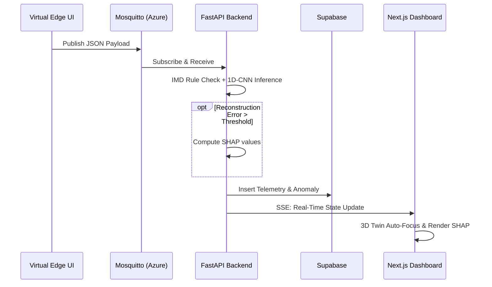

# SkyGuard AI MVP: Minimum User Flows

## 1. Primary Flow: Real-Time Anomaly Detection & SHAP Explainability

This is the core, automated loop that runs continuously during your demonstration, moving data from the virtual edge to the 3D dashboard.

- **Data Generation:** The `/edge-simulator` background worker publishes a JSON telemetry payload via MQTT to your Azure-hosted Eclipse Mosquitto broker.
- **Ingestion & Hard Rules:** The FastAPI backend consumes the message and runs it against the India Meteorological Department (IMD) hard rules (e.g., RH ≤ 100%).
- **Deep Inference:** Valid data is appended to a 12-timestep rolling buffer and fed into the 1D-CNN Autoencoder.
- **Evaluation:** The system calculates the reconstruction error. If it exceeds the threshold, the backend generates SHAP values to isolate the exact culprit sensor.
- **Storage & Push:** The raw telemetry and anomaly metadata are written to Supabase (PostgreSQL), immediately triggering a Server-Sent Events (SSE) push to the frontend.
- **UI Visualization:** The Next.js dashboard updates: the Three.js Digital Twin flashes red, the camera smoothly auto-focuses on the faulty sensor node, and the SHAP bar chart renders on the side panel.

### Sequence Diagram

## 2. Secondary Flow: The Active Learning "Feedback Loop"

This flow demonstrates the system's ability to learn from its operators and mitigate alert fatigue over time.

- **Alert Review:** The dashboard operator clicks on an active anomaly card in the UI.
- **Human Override:** Recognizing a natural, localized weather event, the operator clicks the "Mark as False Alarm" button.
- **Data Logging:** The Next.js app sends a POST request to `/api/v1/model/feedback`, logging the event in the `human_feedback_events` table.
- **Latent Space Clustering:** The backend extracts the 1D-CNN's latent bottleneck vector for that specific sample and applies DBSCAN clustering.
- **System Adaptation:** If the vector falls into a dense cluster of previous false alarms, the UI displays a notification: *"System Learning: Recurrent False Positive pattern identified. Recommend threshold adjustment."*

## 3. Demo Flow: The 5-Minute "Auto-Scenario" Pitch Script

This flow ensures a flawless, hands-free live presentation for the judges.

- **Initialization:** The presenter clicks "Run Pitch Script" on the `/edge-simulator` UI, triggering a pre-programmed timeline.
- **T+0:00 (Baseline):** The simulator streams normal diurnal weather cycles. The 3D Twin is green.
- **T+1:30 (True Negative Test):** A severe thunderstorm is simulated (sharp pressure drop, humidity spike). The CNN processes the multivariate shift and correctly leaves the station green.
- **T+3:00 (Subtle Degradation Test):** The simulator injects a slow +15% humidity capacitive drift.
- **T+3:45 (Detection):** The CUSUM drift logic trips. The 3D Twin turns red, zooms into the humidity shield, and displays a maintenance alert.

## Analytics Question

What specific anomaly metric (e.g., F1-Score or False Alarm Rate reduction) would you like to highlight first on the dashboard's analytics tab?