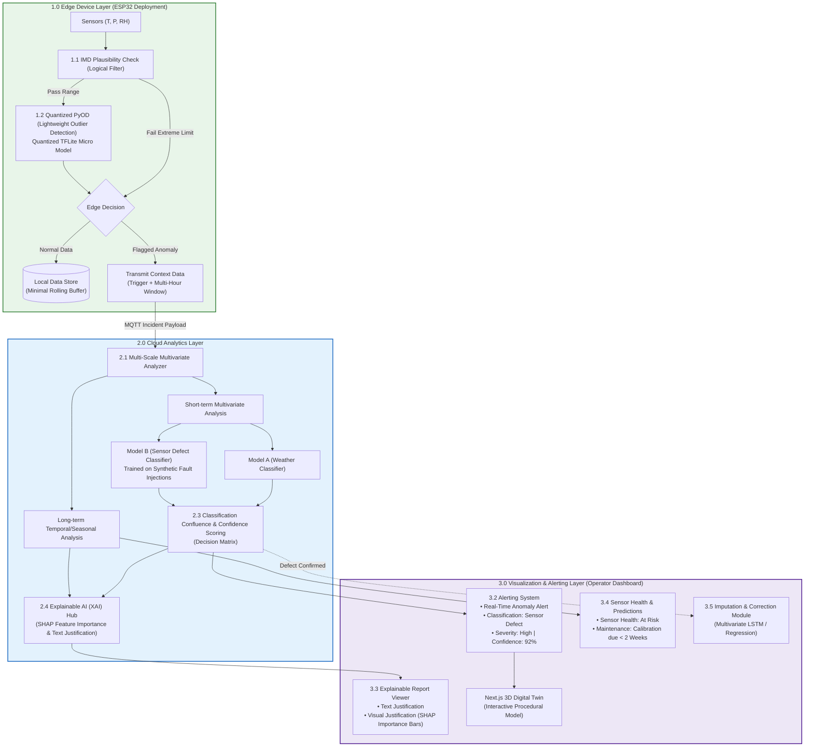

# Product Requirements Document — SkyGuard AI
## Split-Edge/Cloud Anomaly Detection, Dual-Model Confluence, and Predictive Maintenance for Automatic Weather Stations

| Field | Value |
|---|---|
| **Document Version** | 2.1 (Split-Edge/Cloud Architecture) |
| **Status** | Approved for Build |
| **Owner** | Project Lead / ML Systems Engineer |
| **Last Updated** | 2026-09-27 |
| **Target Release** | Hackathon MVP / Portfolio Production Showcase |
| **Classification** | Public / Portfolio |

### Revision History

| Version | Date | Author | Change |
|---|---|---|---|
| 1.0 | — | — | Initial hackathon scope |
| 2.0 | 2026-09-16 | — | Full expansion: architecture, data contracts, ML spec, NFRs |
| 2.1 | 2026-09-27 | Architecture Team | Split-Edge/Cloud deployment (ESP32/TFLite Micro), Dual-Model Confluence (Weather vs. Defect with synthetic fault injection), XAI Hub, Predictive Maintenance (3.4), and Imputation Module (3.5) |

---

## 1. Executive Summary

Automatic Weather Stations (AWS) are deployed across remote, harsh environments where sensors degrade, drift, and fail silently. Conventional monitoring relies on **static single-parameter threshold rules** (e.g., "alert if relative humidity > 100%"). These rules fail to catch silent sensor drift, environmental noise, and cross-channel decoupling, leading to severe alarm fatigue.

**SkyGuard AI** implements a **Split-Edge/Cloud Architecture** that reconciles compute constraints with deep learning capabilities:

1. **Edge Device Layer (1.0 — ESP32 Deployment)**: Microcontrollers execute front-line, two-stage filtering: zero-cost deterministic IMD logical checks and quantized micro outlier detection (Quantized PyOD / TFLite Micro). Normal data is stored locally; only flagged anomalies trigger an MQTT uplink containing the trigger packet and a 2–4 hour pre-anomaly contextual buffer, preserving >90% wireless bandwidth.
2. **Cloud Analytics Layer (2.0 — Structured Confluence Reasoning)**: Context-rich anomalies are evaluated by a Multi-Scale Analyzer and a **Dual-Model Classifier**:
   - **Model A (Weather Classifier)**: Distinguishes natural severe weather phenomena (squall lines, thunderstorms, temperature inversions).
   - **Model B (Sensor Defect Classifier)**: Specially trained on synthetically injected sensor defects (frozen flatlines, impulse spikes, noise bursts, drift, packet loss) to circumvent the complete lack of real-world sensor failure datasets.
   - **Classification Confluence & Confidence Scoring**: A deterministic decision matrix fuses Model A and Model B outputs into an auditable classification and confidence score ($0-100\%$).
3. **Operational Assurance & Full Lifecycle (3.0 — Dashboard)**:
   - **Explainable AI (XAI) Hub (3.3)**: Generates per-sensor SHAP importance charts and plain-English text justifications.
   - **Sensor Health & Predictive Maintenance (3.4)**: Tracks long-term cumulative drift via EWMA to forecast recalibration due dates weeks in advance.
   - **Imputation & Correction Module (3.5)**: Reconstructs corrupt readings using multivariate regression / LSTM across surviving healthy sensors.
   - **3D Digital Twin**: Interactive Three.js model of station `AGRA-01` with automated camera targeting of culprit sensor shields.

---

## 2. Problem Statement & Root Causes

### 2.1 Current State vs. SkyGuard AI

| Aspect | Conventional Systems | SkyGuard AI |
|---|---|---|
| **Edge Compute** | Passive data loggers; no filtering | Two-stage edge filtering (IMD rules + Quantized PyOD in TFLite Micro on ESP32) |
| **Bandwidth** | Continuous 24/7 raw streaming over cellular | Edge buffering; incident bursts with 2–4 hr context window upon anomaly |
| **Reasoning Engine** | Single-parameter static thresholds | Dual-Model Confluence (Model A Weather vs. Model B Defect) |
| **Defect Data Scarcity** | No labeled failure data available | Synthetic fault injection into clean weather series for Model B training |
| **Explainability** | Opaque binary flags | SHAP feature attributions + natural-language justifications |
| **Post-Failure Action** | Discard data / gap in record | Multivariate LSTM Imputation & Predictive Maintenance calibration warnings |

### 2.2 Root Causes Addressed

1. **Univariate Blindness**: Inter-channel physics ($T \leftrightarrow P \leftrightarrow RH$) are monitored by the Multi-Scale Analyzer.
2. **Defect Data Non-Existence**: Mathematical injection of 5 fault archetypes (drift, freeze, spike, noise, dropout) enables robust supervised defect classification without real-world historical failure datasets.
3. **Compute Realities**: ESP32 microcontrollers cannot run dual-agent LLMs; edge-filtering + cloud confluence provides state-of-the-art accuracy within real hardware limits.

---

## 3. Goals, Non-Goals, and Success Metrics

### 3.1 Goals

| ID | Goal | Type |
|---|---|---|
| **G-1** | Pre-filter obvious errors locally on ESP32 with sub-15 ms latency | Technical |
| **G-2** | Differentiate severe storms from sensor failures via Dual-Model Confluence | Technical |
| **G-3** | Reduce false alarms by $\ge 85\%$ compared to static IMD threshold baselines | Operational |
| **G-4** | Train Model B using synthetic fault injections to achieve $\ge 94\%$ defect precision | ML Engineering |
| **G-5** | Provide SHAP feature attributions and plain-English explanations for every alert | Product / XAI |
| **G-6** | Track long-term sensor drift (Objective 6) to forecast maintenance calibration schedules | Predictive Ops |
| **G-7** | Impute damaged parameters from healthy cross-correlated channels upon confirmed defect | Data Quality |
| **G-8** | Deliver a polished 3D Digital Twin with automatic culprit camera auto-focus | Visualization |

### 3.2 Non-Goals (Out of Scope for MVP)

- ❌ General weather forecasting (focus is strictly data integrity and quality assurance)
- ❌ Non-deterministic LLM chat agents in the critical alerting loop (replaced by deterministic Confluence Matrix)
- ❌ Multi-tenant commercial billing infrastructure
- ❌ Autonomous automated physical actuator recalibration without operator verification

### 3.3 Success Metrics

| Metric | Target | Verification Method |
|---|---|---|
| **Edge Memory Footprint** | $< 120\,\text{KB}$ Flash, $< 48\,\text{KB}$ SRAM | TFLite Micro build size profiling |
| **Edge Filter Latency** | $< 15\,\text{ms}$ on ESP32 @ 240 MHz | Hardware timer benchmarks |
| **Model A Recall (Storms)** | $\ge 96.0\%$ | Held-out IMD extreme event validation set |
| **Model B Precision (Faults)** | $\ge 94.0\%$ | Synthetic fault injection test suite |
| **Confluence F1-Score** | $\ge 0.92$ | Multi-scenario benchmark matrix |
| **Maintenance Horizon** | $\ge 14$ days advance notice on sensor drift | 30-day cumulative residual drift simulation |
| **Imputation MAE** | $T \le 0.6^\circ\text{C}$, $RH \le 4.5\%$, $P \le 0.8\,\text{hPa}$ | Cross-validation against ground-truth weather series |

---

## 4. User Personas & Core User Stories

### 4.1 Personas
- **Meera — IMD Field Station Operator**: Needs trustworthy, explainable alerts and maintenance forecasts to schedule site visits efficiently.
- **Arjun — Systems & Data Engineer**: Needs bandwidth-efficient edge-to-cloud transport and reliable MQTT plumbing.
- **Dr. Rao — Meteorologist / QA Lead**: Needs scientific justification for flagged data and imputed values to maintain downstream forecast model inputs.

### 4.2 Key User Stories
- **US-01 (Edge Filtering)**: As an edge node, I want to filter normal data locally and transmit context buffers only on anomalies to save wireless bandwidth.
- **US-02 (Confluence Reasoning)**: As an operator, I want natural weather events separated from sensor defects with an explicit confidence score so I never panic during true thunderstorms.
- **US-03 (Explainability)**: As an operator, I want SHAP attribution bars and a natural-language report telling me exactly why a sensor was flagged.
- **US-04 (Predictive Maintenance)**: As a maintenance planner, I want to see sensors marked "At Risk" with estimated days to recalibration before they fail completely.
- **US-05 (Imputation)**: As a meteorologist, I want the system to suggest an imputed replacement value for faulty readings derived from healthy correlated sensors.

---

## 5. Scope & System Architecture

### 5.1 Architecture Diagram

### 5.2 Deliverables Breakdown

| Layer | Component | Status / Deliverable |
|---|---|---|
| **1.0 Edge** | 1.1 IMD Plausibility Check | C++ / Python rule implementation checking climatological and rate bounds |
| **1.0 Edge** | 1.2 Quantized PyOD | INT8 TFLite Micro model / Quantized Autoencoder |
| **1.0 Edge** | 1.3 Context Buffer Transmission | Circular buffer sending flagged telemetry + 2–4 hr pre-anomaly context |
| **2.0 Cloud** | 2.1 Multi-Scale Analyzer | Short-term cross-derivative tensor + long-term diurnal baseline engine |
| **2.0 Cloud** | 2.2 Model A & Model B | LightGBM / 1D-CNN classifiers (Model B trained with synthetic fault injections) |
| **2.0 Cloud** | 2.3 Classification Confluence | Deterministic decision matrix with confidence scoring formula |
| **2.0 Cloud** | 2.4 Explainable AI Hub | SHAP attribution generator + natural-language report creator |
| **3.0 Dashboard** | 3.2 Alerting System | Live classification badge, severity rating, confidence score |
| **3.0 Dashboard** | 3.3 Report Viewer | Formatted plain-English summary + interactive SHAP bar chart |
| **3.0 Dashboard** | 3.4 Sensor Health & Predictions | EWMA drift tracker projecting days until calibration is due |
| **3.0 Dashboard** | 3.5 Imputation & Correction | Multivariate LSTM / regression model providing suggested replacement values |
| **3.0 Dashboard** | 3D Digital Twin | Next.js 14 / Three.js interactive station with camera auto-targeting |