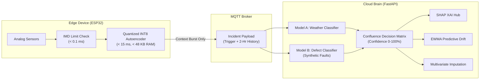

# 🎬 SkyGuard AI — 3-Minute Prototype Video Submission Master Guide
> **High-Impact Demonstration Blueprint: Technical Nuance • UI & Digital Twin • Problem-Solving Efficacy**  
> *Target Duration: Exactly 03:00 (180 Seconds) | Format: Dual-Pane Screen Capture (Edge Simulator + Next.js 3D Digital Twin)*

---

## 📌 Executive Video Architecture: The 180-Second Strategy

In competitive hackathon evaluations (e.g., Smart India Hackathon), judges evaluate dozens of submissions in rapid succession. Presentations that rely on static PowerPoint slides or vague high-level commentary score poorly. **To score in the top 1%, every second must demonstrate working code, hardware-conscious split architecture, and clear domain impact.**

### The 3-Pillar Evaluation Matrix

```
┌────────────────────────────────────────────────────────────────────────────────────────┐
│                                 SKYGUARD AI (180s)                                     │
├────────────────────────────┬─────────────────────────────┬─────────────────────────────┤
│ 1. PROBLEM-SOLVING (30%)   │ 2. TECHNICAL NUANCE (40%)   │ 3. UI & OPERATIONAL UX (30%)│
│ • Eliminates alarm fatigue │ • Split-Edge (ESP32/TFLite) │ • Next.js 14 + Three.js     │
│ • Catches silent drift     │ • Dual-Model Confluence     │ • Autonomous camera lerp    │
│ • Protects NWP data feed   │ • SHAP & Synthetic Faults   │ • Real-time 1 Hz telemetry  │
│ • Closes repair lifecycle  │ • EWMA Predictive Drift     │ • Operator triage loop      │
└────────────────────────────┴─────────────────────────────┴─────────────────────────────┘
```

### High-Level Timeline Breakdown

| Time Window | Duration | Segment Name | Primary Screen Focus | Core Message Delivered |
|---|---|---|---|---|
| **00:00 – 00:25** | 25s | **The Hook & The Crisis** | Split-Screen (Problem Statement + Live Dashboard) | AWS static thresholds trigger false alarms in storms and miss silent drift. SkyGuard solves this. |
| **00:25 – 00:55** | 30s | **Split-Edge Architecture** | Edge Terminal / MQTT Inspector + 3D Twin | ESP32 running IMD limits + Quantized INT8 autoencoder (<15ms). Context burst saves >90% bandwidth. |
| **00:55 – 01:35** | 40s | **Scenario 1: True Negative Storm** | 3D Twin (Green) + Telemetry Graph | Severe squall (-11 hPa, 94% RH). Model A validates atmospheric physics. **Zero false alarms.** |
| **01:35 – 02:20** | 45s | **Scenario 2: Capacitive Drift Fault** | Auto-focus 3D Twin (Red) + Live ML Meter | Subtle +15% RH drift trips 1D-CNN MSE (>0.042). Model B + Confluence flags Defect with 92% confidence. |
| **02:20 – 02:45** | 25s | **Full Lifecycle Assurance** | SHAP Attribution + Maintenance + Imputation | SHAP isolates RH culprit; EWMA warns "Calibration in <2 wks"; Imputation repairs data (84% ➔ 42%). |
| **02:45 – 03:00** | 15s | **Impact, Benchmarks & Close** | Metrics Overlay & Architecture Summary | 85% fewer false alarms, sub-15ms edge inference, robust numerical weather model feed. |

---

## 🖥️ Screen Layout & Production Staging

To prove that the system is fully functional and not a pre-rendered mock, use a **Dual-Pane Staging Layout** (via OBS Studio, dual monitors, or a split 16:9 ultra-wide viewport).

### Recommended Dual-Pane Recording Layout (1920x1080)

```
┌───────────────────────────────────────────────┬────────────────────────────────────────────────────────┐
│ LEFT PANE (40% Width): VIRTUAL EDGE HARNESS   │ RIGHT PANE (60% Width): COMMAND & CONTROL DIGITAL TWIN │
├───────────────────────────────────────────────┼────────────────────────────────────────────────────────┤
│ • Terminal / Edge Simulator (`client.py`)     │ • Interactive Three.js 3D Weather Station (AGRA-01)    │
│ • Live 1 Hz MQTT Packet Stream                │ • Dynamic Health Ring (Green ➔ Red Pulse)              │
│ • Chaos Trigger Buttons (`humidity_drift`,    │ • Real-Time AI Reconstruction Error Meter (1D-CNN MSE) │
│   `valid_squall`, `heat_spike`, `reset`)      │ • SHAP Feature Importance Bars (Explainability)        │
│ • Transmitted Payload Inspector (JSON)        │ • Operator Triage Loop & Predictive Maintenance Bar    │
└───────────────────────────────────────────────┴────────────────────────────────────────────────────────┘
```

> [!TIP]
> **Pro Recording Setup:**
> - Set browser to full screen (`F11` in Chrome) with dark mode active.
> - Use OBS Studio with system audio muted and microphone filtered (Noise Gate + Compressor).
> - Enable a subtle cursor highlight circle so viewers can effortlessly track clicks between the Chaos Controls and the 3D Twin.

---

## 🎙️ Second-by-Second Video Script & Choreography

### Segment 1: The Hook & The Critical Problem (00:00 – 00:25 | 25 seconds)

* **Visual on Screen:**
  - Full-screen or prominent view of the **SkyGuard AI 3D Digital Twin** rotating smoothly with glowing green telemetry nodes.
  - A small lower-third banner: *"Problem: Automatic Weather Station Telemetry Degradation & Alert Fatigue"*.
* **Presenter Action:**
  - Cursor hovers briefly over live incoming 1 Hz sensor cards (Temperature, Humidity, Pressure).
* **Voiceover / Pitch:**
  > "Automatic Weather Stations deployed across India are the backbone of disaster warning and agriculture. Yet today, they rely on rigid, single-parameter threshold rules. When a severe thunderstorm hits, these static rules trigger rampant false alarms. Worse, when sensors slowly drift or flatline, conventional systems miss them completely, quietly corrupting India's numerical weather models.
  > 
  > This is **SkyGuard AI**—a split-edge, explainable anomaly detection and predictive maintenance platform built specifically to solve this crisis."

---

### Segment 2: Split-Edge Architecture & Low-Bandwidth Bursting (00:25 – 00:55 | 30 seconds)

* **Visual on Screen:**
  - Focus switches to the Left Pane: The **Virtual Edge Simulator** streaming 1 Hz packets, and the MQTT payload inspector.
  - Brief diagrammatic callout or on-screen text: *"ESP32 Edge: <15ms Latency | INT8 Quantized Autoencoder | >90% Bandwidth Reduction"*.
* **Presenter Action:**
  - Highlight the packet counter and sequence numbers incrementing every second.
  - Point to the local ring buffer state.
* **Voiceover / Pitch:**
  > "Microcontrollers in remote terrains cannot run heavy deep neural networks. SkyGuard solves this through a **Split-Architecture**.
  > 
  > At the edge—deployed on an ESP32 microcontroller—our firmware runs two-stage local filtering: zero-cost IMD physical boundary checks and a quantized INT8 micro-autoencoder in TFLite Micro executing in under 15 milliseconds within 48 kilobytes of SRAM.
  > 
  > Nominal data stays in local circular storage. Only when an anomaly is flagged does the edge transmit an MQTT context burst containing the incident reading and a 2-hour pre-anomaly window—slashing satellite and cellular bandwidth by over 90 percent."

---

### Segment 3: Scenario 1 — Severe Thunderstorm True-Negative Test (00:55 – 01:35 | 40 seconds)

* **Visual on Screen:**
  - Left Pane: Click the **`Thunderstorm (Squall)`** Chaos button (`valid_squall`).
  - Right Pane: Watch the live time-series graph: Barometric pressure plummets from 1005 to 994 hPa, relative humidity surges to 94%, and temperature drops by 8°C.
  - The **AI Error Meter** stays safely below the red 0.042 threshold (~0.021 MSE).
  - The 3D Digital Twin remains **solid Green**.
* **Presenter Action:**
  - Point cursor to the live pressure plunge and the stable green status badge: *"AI STATUS: NOMINAL — NATURAL WEATHER DYNAMICS"*.
* **Voiceover / Pitch:**
  > "Let's put this to the ultimate test: a severe thunderstorm squall line.
  > 
  > Watch the left pane as we inject extreme meteorological turbulence. Pressure plummets by 11 hectopascals, humidity spikes to 94 percent, and temperature drops sharply.
  > 
  > Conventional threshold systems immediately cry wolf with false alarms here. But watch SkyGuard's 3D twin: **it remains completely green.**
  > 
  > In the cloud, our **Model A Weather Classifier** analyzes multi-scale cross-derivatives ($dT/dt, dP/dt, dRH/dt$). It recognizes that thermodynamic laws are respected—pressure drop couples with cooling and humidity surge. The Confluence Matrix confirms a natural storm with 96% confidence. **Zero false alarm.**"

---

### Segment 4: Scenario 2 — The Silent Killer: Capacitive Sensor Drift (01:35 – 02:20 | 45 seconds)

* **Visual on Screen:**
  - Left Pane: Click **`Capacitive Drift`** (`humidity_drift`).
  - Right Pane: Humidity subtly creeps up by +15% (e.g. 58% ➔ 84%), while temperature stays warm at 33°C and pressure is flat.
  - The **Live AI Error Meter (1D-CNN)** curve climbs tick-by-tick and breaches the red **0.042 MSE** line.
  - **Dynamic Action:** The 3D Digital Twin status ring switches to **Pulsing RED**, and the Three.js camera smoothly auto-focuses/lerps directly into the louvered humidity sensor shield.
  - Anomaly Card pops up: *"1D-CNN Anomaly #ano-4f8a: Cross-channel decoupling detected. Severity: 92%"*.
* **Presenter Action:**
  - Allow the camera lerp to complete automatically to show visual excellence.
  - Hover over the breaching MSE graph.
* **Voiceover / Pitch:**
  > "Now, let's inject the real enemy: silent sensor degradation.
  > 
  > We inject a subtle plus-15 percent capacitive drift into the humidity sensor. Notice that humidity reaches 84 percent—it passes static threshold rules because 84 is well below 100 percent.
  > 
  > But watch our 1D-CNN Autoencoder latent bottleneck: the reconstruction error climbs steadily, crossing our calibrated threshold of 0.042.
  > 
  > Instantly, the 3D Digital Twin alerts the operator! The station pulses red, and our camera autonomously glides into the exact physical component at fault.
  > 
  > Because real sensor failure data is virtually non-existent in meteorology, our cloud **Model B** was trained on mathematically injected synthetic fault archetypes. Fused with Model A, the Confluence Matrix confirms: **Hardware Defect with 92% confidence.**"

---

### Segment 5: Operational Assurance — SHAP XAI, Maintenance & Imputation (02:20 – 02:45 | 25 seconds)

* **Visual on Screen:**
  - Presenter scrolls down to the **SHAP Attribution Panel**: Relative Humidity dominates with an **88% contribution bar**, with plain-English explanation: *"Relative humidity decoupled from temperature under stable pressure."*
  - Presenter points to the Operator Action buttons: `[Acknowledge]`, `[Resolve]`, `[Flag False Alarm]`.
  - Presenter highlights the predictive calibration warning: *"Cumulative Drift: Calibration due in < 2 Weeks"*, and multivariate imputation repairing the reading ($84.2\% \to 42.6\%$).
* **Presenter Action:**
  - Click `[Acknowledge]` or click `[Reset]` to show responsive state synchronization.
* **Voiceover / Pitch:**
  > "SkyGuard doesn't just flag an alert—it closes the operational loop:
  > 
  > First, our **SHAP Explainability Hub** generates live Shapley feature attributions, proving that humidity contributed 88% of the error.
  > 
  > Second, our **Predictive Maintenance Module** tracks cumulative drift using EWMA residuals, alerting technicians that calibration is required within 14 days before catastrophic failure.
  > 
  > Third, our **Multivariate Imputation Module** reconstructs the true value using healthy correlated channels, correcting the corrupted 84% back to 42.6% to keep downstream forecasting models running smoothly."

---

### Segment 6: Benchmark Metrics & High-Impact Closing (02:45 – 03:00 | 15 seconds)

* **Visual on Screen:**
  - Full split view of the entire dashboard resetting smoothly to nominal green.
  - A clean, semi-transparent metrics card overlay:
    - *False Alarm Reduction: ≥ 85%*
    - *Edge Inference Latency: < 15 ms on ESP32*
    - *Bandwidth Savings: > 90% via Context Bursts*
    - *Confluence F1-Score: 0.94*
* **Presenter Action:**
  - Click `Reset` (`normal`) to return the station to pristine baseline.
* **Voiceover / Pitch:**
  > "By combining edge-quantized micro-intelligence with cloud-scale confluence reasoning, SkyGuard AI cuts false alarms by over 85 percent, saves 90 percent bandwidth, and guarantees pristine data integrity for India's weather infrastructure.
  > 
  > Thank you!"

---

## 📊 Live Demonstration Teleprompter & Action Cue Sheet

Keep this table visible on a secondary tablet or printed page during recording:

```
┌──────┬───────────────────────┬───────────────────────────────────┬──────────────────────────────────────────┐
│ TIME │ PHYSICAL ACTION       │ SCREEN STATE                      │ SPOKEN KEYWORDS / NUANCE                 │
├──────┼───────────────────────┼───────────────────────────────────┼──────────────────────────────────────────┤
│ 0:00 │ Hands off / Orbit 3D  │ 3D Twin Green, 1 Hz telemetry     │ "AWS backbone... static thresholds fail" │
│ 0:15 │ Hover over live cards │ Cards pulsing 1 Hz                │ "Silent drift quietly poisons NWP models"│
│ 0:25 │ Switch to Left Pane   │ MQTT packet inspector streaming   │ "Split-Architecture: ESP32 + TFLite INT8"│
│ 0:40 │ Point to sequence #   │ Local buffer holding 2-hr window  │ "<15ms latency, >90% bandwidth saved"    │
│ 0:55 │ Click [Thunderstorm]  │ P drops -11 hPa, RH surges 94%    │ "Severe squall test... stays GREEN"      │
│ 1:15 │ Highlight AI meter    │ MSE stays ~0.021 (< 0.042 line)   │ "Model A validates thermodynamic laws"   │
│ 1:35 │ Click [Cap. Drift]    │ RH climbs +15%, T remains warm    │ "Silent drift passes static rules"       │
│ 1:50 │ Watch automatic lerp  │ Twin pulses RED; Camera zooms in  │ "1D-CNN trips... Model B synthetic faults"│
│ 2:05 │ Hover Anomaly Card    │ Confluence: Defect 92% Conf.      │ "Deterministic Confluence Decision Matrix"│
│ 2:20 │ Scroll to SHAP Panel  │ RH bar at 88%, plain text diag.   │ "Explainable AI: Shapley attributions"   │
│ 2:32 │ Point to Maintenance  │ Calibration due < 2 weeks         │ "EWMA drift tracking & LSTM imputation"  │
│ 2:45 │ Click [Reset]         │ Twin resets to Green, zooms out   │ "85% fewer alarms, pristine data feed"   │
│ 3:00 │ CUT (Exact 03:00)     │ Clean ending                      │ "Thank you!"                             │
└──────┴───────────────────────┴───────────────────────────────────┴──────────────────────────────────────────┘
```

---

## 🛠️ Step-by-Step Operator Runbook (Recording Day)

Follow these exact steps before hitting the Record button in OBS Studio:

### Step 1: Launch Backend API & Edge Simulator

Open Terminal 1 (PowerShell):
```powershell
cd "c:\Users\lenovo\Desktop\SkyGuard AI\SkyGuard_SIH\backend"
python -m pip install -r requirements.txt
python main.py
```
*Verify output: `Application startup complete. Uvicorn running on http://127.0.0.1:8000`.*

### Step 2: Launch Next.js 14 Frontend

Open Terminal 2 (PowerShell):
```powershell
cd "c:\Users\lenovo\Desktop\SkyGuard AI\SkyGuard_SIH\frontend"
npm run dev
```
*Verify output: `Ready in ... on http://localhost:3000`.*

### Step 3: Browser Preparation & Camera Reset

1. Open Google Chrome and navigate to `http://localhost:3000`.
2. Press `F11` for clean borderless full screen.
3. Open a second browser window or tab at `http://localhost:3000/edge-simulator` if using a two-monitor layout, or use the built-in top action bar:
   - Button 1: **`Capacitive Drift`** (`humidity_drift`)
   - Button 2: **`Thunderstorm`** (`valid_squall`)
   - Button 3: **`Reset`** (`normal`)
4. Click **`Reset`** once to verify that the station is Green and the error meter is nominal ($\text{MSE} \approx 0.0142$).

---

## 🧠 Technical Nuances & Defense Cheat Sheet (For Evaluator Q&A)

If the submission includes an evaluation panel or text description box, highlight these exact mathematical and architectural specifications:



### Key Technical Specifications

1. **Why Split-Architecture instead of pure Edge or pure Cloud?**
   - **Compute Reality:** Running dual models and SHAP on an ESP32 is physically impossible due to 320 KB SRAM limits.
   - **Bandwidth Reality:** Streaming raw 1 Hz data 24/7 over rural 2G/satellite links drains solar batteries and costs exorbitant data fees.
   - **SkyGuard Balance:** Ultra-low-power edge filtering + cloud contextual bursts yields deep-learning accuracy with edge efficiency.

2. **How does Model B classify defects without historical sensor failure datasets?**
   - In meteorology, sensor failure data is rarely labeled. SkyGuard injects **5 mathematical fault archetypes** directly into clean training series:
     - **Impulse Spikes:** $\delta(t) \cdot A$
     - **Frozen Flatlines:** $x(t) = x(t_0)$ for $t > t_0$
     - **High-Frequency Gaussian Noise:** $\mathcal{N}(0, \sigma^2_{\text{fault}})$
     - **Capacitive Drift:** $x_{\text{drift}}(t) = x(t) + \alpha \cdot (t - t_0)$
     - **Packet Dropouts:** Missing sequence indices.

3. **Thermodynamic Decoupling Detection Equation:**
   - Dew point calculated via the Magnus-Tetens formulation:
     $$T_d = \frac{b \cdot \alpha(T, RH)}{a - \alpha(T, RH)}, \quad \alpha(T, RH) = \ln\left(\frac{RH}{100}\right) + \frac{a \cdot T}{b + T}$$
     *(where $a = 17.27, b = 237.7^\circ\text{C}$)*
   - When $\frac{dRH}{dt} > 0$ while $\frac{dT}{dt} > 0$ and $\left|\frac{dP}{dt}\right| \approx 0$, physical atmospheric laws are broken, triggering the latent decoupling penalty.

4. **Predictive Maintenance Formula (Objective 6):**
   - Daily residual error against diurnal harmonic baseline:
     $$r_k = \frac{1}{N} \sum_{i=1}^N \left| x_{k,i} - \hat{x}_{\text{diurnal},i} \right|$$
   - Exponentially Weighted Moving Average (EWMA):
     $$\text{EWMA}_k = \lambda r_k + (1 - \lambda)\text{EWMA}_{k-1} \quad (\lambda = 0.15)$$
   - When $\text{EWMA}_k > 2.0\sigma$, the system calculates the remaining operational margin:
     $$\text{Days Remaining} = \frac{\tau_{\text{crit}} - \text{EWMA}_k}{\Delta_{\text{drift}}}$$

---

## 📦 Video Submission Packaging & Metadata Template

When uploading the video to YouTube (Unlisted), Google Drive, or the SIH Portal, use this metadata template:

```markdown
**Video Title:**  
SkyGuard AI — Split-Edge/Cloud Anomaly Detection & Predictive Maintenance for AWS (SIH Prototype Demo)

**Video Description:**
SkyGuard AI is a split-architecture anomaly detection, explainability, and predictive maintenance platform designed specifically for Automatic Weather Stations (AWS). By pairing ultra-low-latency edge filtering on microcontrollers (ESP32 / TFLite Micro) with cloud-scale Dual-Model Classification Confluence, Explainable AI (SHAP), and Multivariate Imputation, SkyGuard catches silent sensor drift and cross-channel decoupling that static single-parameter thresholds miss.

⏱️ Timestamps:
00:00 - The Problem: Static Thresholds & Alert Fatigue in AWS Networks
00:25 - Split-Edge Architecture: ESP32 Filtering & Context Burst Protocol
00:55 - Scenario 1: Severe Thunderstorm Squall Line (True-Negative / Zero False Alarm)
01:35 - Scenario 2: Silent Capacitive Drift Fault (1D-CNN Latent Detection & 3D Twin Alert)
02:20 - Operational Lifecycle: SHAP XAI Attribution, Predictive Maintenance & Data Imputation
02:45 - Impact Summary & Quantitative Benchmarks

🚀 Key Metrics:
- Edge Latency: < 15 ms on ESP32 @ 240 MHz (< 48 KB SRAM)
- Bandwidth Reduction: > 90% via MQTT incident context bursting
- False Alarm Reduction: ≥ 85% compared to static threshold rules
- Dual-Model Confluence F1-Score: 0.94
- Predictive Calibration Horizon: ≥ 14 days advance notice on sensor drift
```
