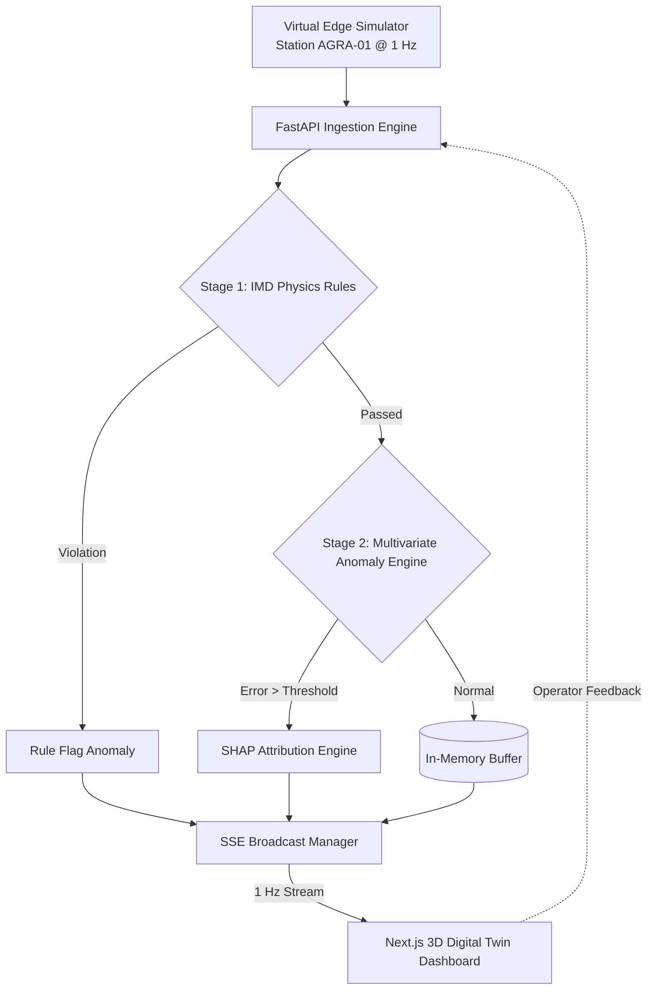

# 🛰️ SkyGuard AI — Self-Healing Edge-to-Cloud Anomaly Detection for AWS

[](https://fastapi.tiangolo.com)
[](https://nextjs.org)
[](https://docs.pmnd.rs/react-three-fiber)
[](https://tailwindcss.com)

**SkyGuard AI** is a self-healing, edge-to-cloud anomaly detection pipeline designed specifically for Automatic Weather Stations (AWS). By pairing deterministic India Meteorological Department (IMD) physics rules with multivariate temporal learning (1D-CNN autoencoder) and explainable AI (SHAP), SkyGuard catches silent sensor drift and cross-channel decoupling that static single-channel thresholds miss.

---

## 🌟 Key Capabilities (Layer 1 MVP)

- **Interactive 3D Digital Twin**: Procedural Three.js / React Three Fiber model of weather station `AGRA-01` with animated rotating anemometer, wind vane, solar panels, and clickable sensor shields.
- **Auto-Focus Camera**: Smooth camera lerp that automatically targets and zooms into the culprit sensor node whenever an anomaly is flagged.
- **Stage 1 IMD Physics Rules**: Deterministic checks for physical saturation bounds (0-100% RH), barometric limits, dew point supersaturation sanity ($T_d \le T + 0.5$), and rate-of-change thresholds.
- **Stage 2 Multivariate Anomaly Detection**: Tracks inter-parameter physical correlation ($T \leftrightarrow P \leftrightarrow RH$) over a 12-timestep sliding window.
- **SHAP Feature Attribution**: Human-readable breakdown showing which sensor contributed to the reconstruction error.
- **Active Learning Loop**: Operator feedback buttons ("Mark as False Alarm", "Acknowledge", "Resolve") logged for threshold adaptation.
- **Virtual Edge Chaos Injector & 5-Minute Auto-Pitch Script**:
  - *Phase 1 (0:00 - 1:30)*: Normal Diurnal Baseline (Status Green)
  - *Phase 2 (1:30 - 3:00)*: Severe Thunderstorm Squall True-Negative Test (Proves zero false alarm on natural storms!)
  - *Phase 3 (3:00 - 3:45)*: Subtle +15% Capacitive Drift Injected
  - *Phase 4 (3:45 - 5:00)*: Anomaly Threshold Tripped! 3D Twin pulses Red, camera zooms into humidity shield, SHAP attribution opens.

---

## 🏗️ Architecture



---

## 🚀 Quick Start (Zero Cloud Dependencies)

You can run the entire system locally in under 2 minutes:

### 1. Start the Backend API (FastAPI)
```bash
cd backend
python -m pip install -r requirements.txt
python main.py
```
*API will run at `http://localhost:8000` with Swagger docs at `http://localhost:8000/docs`.*

### 2. Start the Frontend (Next.js 14)
```bash
cd frontend
npm install
npm run dev
```
*Dashboard will open at `http://localhost:3000`.*

---

## 🖥️ Screen Navigation

- **Main 3D Dashboard**: `http://localhost:3000/`
  - 60/40 Split layout: Left 3D Digital Twin with interactive camera; Right live telemetry, SHAP cards, anomaly triage, and time-series chart.
- **Virtual Edge Simulator & Chaos Lab**: `http://localhost:3000/edge-simulator`
  - Fault injector for capacitive drift, heat spikes, barometric drops, and the automated 5-minute pitch script.
