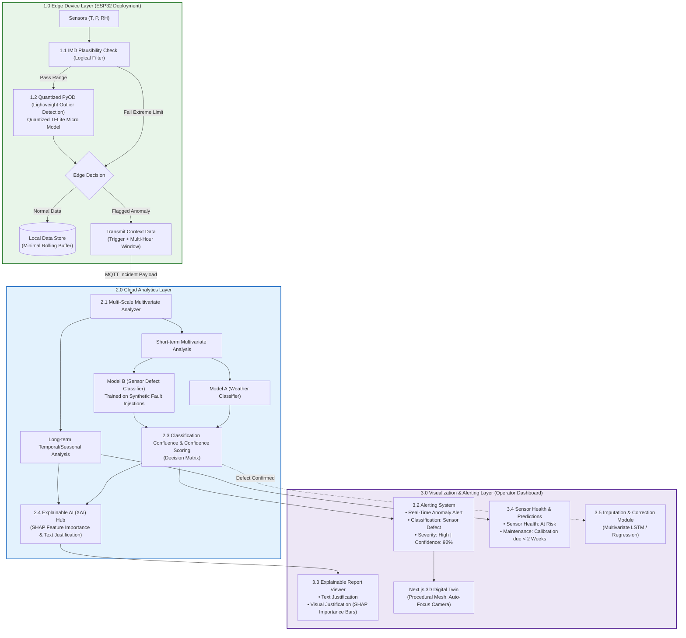

# 🛰️ SkyGuard AI — Split-Edge/Cloud Anomaly Detection for AWS

[](https://fastapi.tiangolo.com)
[](https://nextjs.org)
[](https://docs.pmnd.rs/react-three-fiber)
[](https://tailwindcss.com)

**SkyGuard AI** is a split-architecture anomaly detection, explainability, and predictive maintenance platform designed specifically for Automatic Weather Stations (AWS). By pairing ultra-low-latency edge filtering on microcontrollers (ESP32 / TFLite Micro) with cloud-scale **Dual-Model Classification Confluence**, **Explainable AI (SHAP)**, **Predictive Maintenance**, and **Multivariate Imputation**, SkyGuard catches silent sensor drift and cross-channel decoupling that static single-parameter thresholds miss.

---

> 🎥 **Video Submission Guide (3-Minute Hackathon Demo)**:  
> Check out the complete screenplay, staging layout, voiceover script, and evaluator defense cheat sheet in [PROTOTYPE_VIDEO_SUBMISSION_GUIDE.md](file:///c:/Users/lenovo/Desktop/SkyGuard%20AI/SkyGuard_SIH/PROTOTYPE_VIDEO_SUBMISSION_GUIDE.md).

---

## 🌟 Key Architecture & Capabilities



### 1.0 Edge Device Layer (ESP32 Deployment & Emulation)
- **1.1 IMD Plausibility Check**: Zero-cost logical filter using rigid Indian climatological thresholds (e.g., $T < 0^\circ\text{C}$ in Agra in May). Flags physical impossibilities instantly before invoking ML.
- **1.2 Quantized PyOD (Lightweight Outlier Detection)**: Quantized INT8 micro-autoencoder running within 320 KB SRAM on an ESP32 in $< 15\,\text{ms}$.
- **1.3 Edge Decision & Context Burst**: Normal data logs to local circular storage; flagged anomalies transmit an MQTT context burst containing the trigger reading plus a 2–4 hour pre-anomaly sliding buffer.

### 2.0 Cloud Analytics Layer (Structured Reasoning)
- **2.1 Multi-Scale Multivariate Analyzer**: Performs short-term cross-derivative consistency checks ($T \leftrightarrow P \leftrightarrow RH$) and long-term seasonal/diurnal baseline tracking.
- **2.2 Dual-Model Classification**:
  - **Model A (Weather Classifier)**: Evaluates complex atmospheric dynamics to identify true natural storms.
  - **Model B (Sensor Defect Classifier)**: Overcomes the lack of historical sensor failure datasets by training on **mathematically injected synthetic defect patterns** (frozen flatlines, impulse spikes, Gaussian noise bursts, and capacitive drift).
- **2.3 Classification Confluence & Confidence Scoring**: Evaluates Model A and Model B in tandem via a deterministic decision matrix, computing exact confidence scores ($0-100\%$).
- **2.4 Explainable AI (XAI) Hub**: Quantifies parameter importance with SHAP bar charts and produces plain-English text justifications.

### 3.0 Visualization & Alerting Layer (Operator Dashboard)
- **3.2 Alerting System**: Real-time classification status badge, severity scoring, and culprit sensor indicators.
- **3.3 Explainable Report Viewer**: Displays natural-language diagnostics and SHAP contribution bar charts.
- **3.4 Sensor Health & Predictive Maintenance**: Tracks cumulative daily drift via EWMA to project sensor recalibration deadlines weeks before catastrophic failure occurs.
- **3.5 Imputation & Correction Module**: Automatically reconstructs corrupted sensor readings using multivariate regression / LSTM over surviving healthy channels.
- **Interactive 3D Digital Twin**: Procedural Three.js model of station `AGRA-01` with automated camera lerp targeting the faulty sensor.

---

## 🚀 Quick Start (Local Run)

### 1. Start the Backend API (FastAPI)
```bash
cd backend
python -m pip install -r requirements.txt
python main.py
```
*API will run at `http://localhost:8000` with Swagger documentation at `http://localhost:8000/docs`.*

### 2. Start the Frontend Dashboard (Next.js 14)
```bash
cd frontend
npm install
npm run dev
```
*Dashboard will open at `http://localhost:3000`.*

### 3. Optional Two-Laptop / Edge Simulator Demo
To run the Edge Simulator emulating station `AGRA-01` over MQTT:
```powershell
# In terminal 1 (start local MQTT broker if using Docker):
docker compose up -d mqtt

# In terminal 2 (start client transmitter):
python backend/simulator/client.py --host localhost
```
- Press `1` to inject a Heat Spike.
- Press `2` to inject Capacitive Humidity Drift / Freeze.
- Press `3` to simulate a Severe Thunderstorm Squall (True Negative test).
- Press `0` to return to normal baseline.

---

## 🖥️ Screen Navigation

- **Main Operator Dashboard (`http://localhost:3000/`)**:
  - **Left**: 3D Digital Twin with interactive camera orbit, sensor shield highlights, and pulsing alert nodes.
  - **Right**: Real-time telemetry, Confluence alert card, SHAP feature importance bars, Predictive Maintenance forecast, and Imputed Value recommendations.
- **Virtual Edge Chaos Lab (`http://localhost:3000/edge-simulator`)**:
  - Hands-free 5-minute pitch script and interactive fault injectors.
