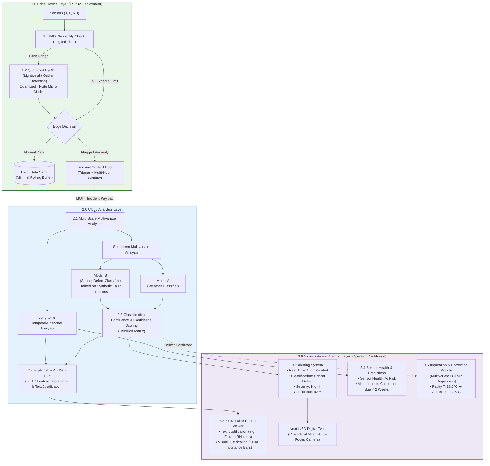
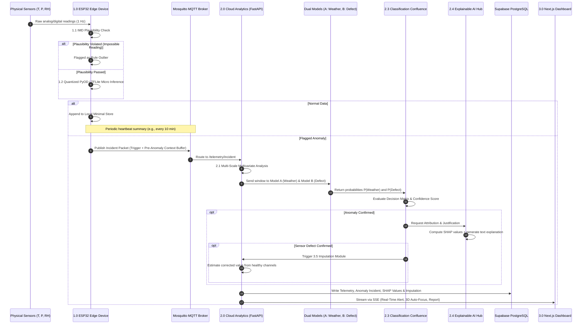
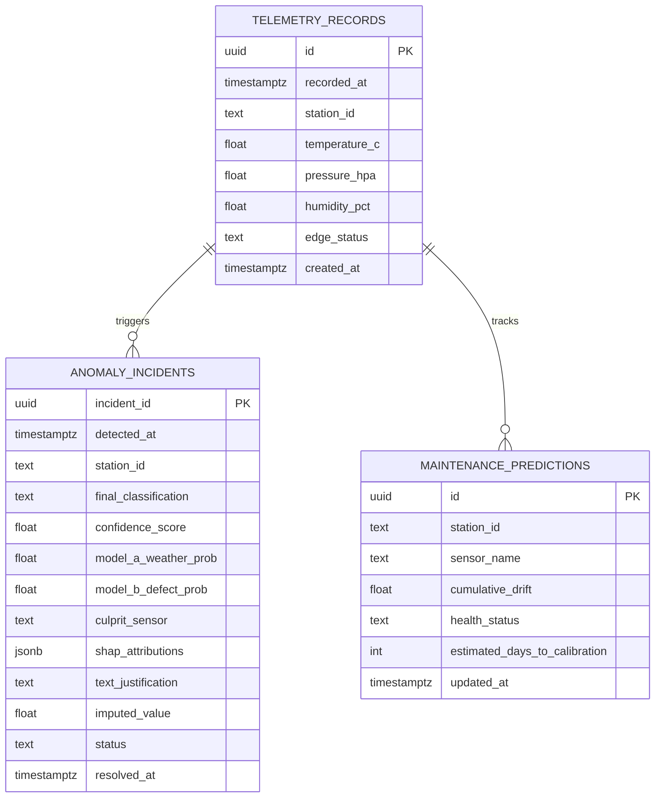

# SkyGuard AI: Split-Edge/Cloud Anomaly Detection Architecture

> A production-grade, split-architecture system designed for Automatic Weather Stations (AWS). By pairing ultra-low-power edge filtering (ESP32 / TFLite Micro) with cloud-scale multivariate deep learning (Dual-Model Classification Confluence), Explainable AI (SHAP), Predictive Maintenance, and Imputation, SkyGuard AI prevents telemetry corruption, eliminates alert fatigue, and guarantees operational integrity without requiring unavailable real-world defect datasets.

---

## 1. Executive Summary & Design Principles

Deploying an end-to-end Machine Learning pipeline on real-world Automatic Weather Stations requires overcoming severe computational and physical constraints: an edge microcontroller like the ESP32 cannot run heavy dual-agent LLMs or full deep learning architectures due to strict memory (RAM/Flash) and power limits. Furthermore, in production meteorology, dedicated labeled datasets of physical sensor defects across multi-parameter weather arrays are non-existent.

SkyGuard AI resolves these bottlenecks through **three foundational design principles**:

1. **Split-Architecture Deployment (Edge ↔ Cloud)**: 
   The front line operates on an ultra-low-power microcontroller (ESP32) performing rapid, two-stage local filtering: zero-cost deterministic IMD physical limit checks and quantized micro outlier detection (Quantized PyOD / TFLite Micro). Nominal data is recorded locally; only anomalous events trigger an uplink burst containing the incident reading along with a multi-hour contextual sliding window. This reduces wireless bandwidth usage by >90% while keeping cloud compute focused solely on ambiguous anomalies.
2. **Structured Reasoning via Classification Confluence**: 
   Rather than relying on non-deterministic LLM agent dialogues, SkyGuard AI formalizes multi-agent reasoning into a rigorous **Classification Confluence Matrix**:
   - **Model A (Weather Classifier)**: Trained on meteorological event signatures (severe storms, frontal passages, squall lines, diurnal swings).
   - **Model B (Sensor Defect Classifier)**: Specially trained on synthetically injected sensor failure archetypes (frozen flatlines, random impulse spikes, high-frequency Gaussian noise, calibration drift, packet dropouts) to circumvent the lack of real defect data.
   - **Confluence Engine**: A deterministic confidence-scoring matrix evaluates Model A and Model B in tandem, producing definitive alert classifications with mathematically sound confidence metrics ($0-100\%$).
3. **Full-Cycle Telemetry Health (Predictive Maintenance & Imputation)**:
   Beyond binary alerting, the architecture completes the full data-quality lifecycle:
   - **Explainable AI (XAI) Hub**: Quantifies feature attributions via SHAP bar charts alongside natural-language diagnostic justifications.
   - **Sensor Health & Predictive Maintenance (3.4)**: Monitors long-term temporal drift to forecast sensor recalibration weeks before total breakdown occurs.
   - **Imputation & Correction Module (3.5)**: When a sensor defect is confirmed, a multivariate regression / LSTM model reconstructs the corrupted parameter using healthy cross-correlated channels.

---

## 2. High-Level Architecture Diagram

The system is structured into three discrete layers: **1.0 Edge Device Layer**, **2.0 Cloud Analytics Layer**, and **3.0 Visualization & Alerting Layer**.



### Simplified Deployment View

```mermaid
graph LR
    subgraph Physical Station / Emulation
        ESP["ESP32 Microcontroller<br/>(FreeRTOS / TFLite Micro)"]
        SIM["Python Edge Simulator<br/>(CI & Demonstration Emulation)"]
    end

    subgraph Cloud Infrastructure (Azure VM / Docker)
        BROKER["Mosquitto MQTT Broker<br/>TLS :8883"]
        CORE["FastAPI Analytics Engine<br/>• Multi-Scale Analyzer<br/>• Model A (Weather) & Model B (Defects)<br/>• Confluence Scorer<br/>• SHAP Hub & Imputation"]
    end

    subgraph Persistence & Frontend
        SUPA[("Supabase PostgreSQL<br/>Telemetry, Anomalies, Drift Logs")]
        VERCEL["Next.js 14 Dashboard & 3D Digital Twin<br/>(Vercel / React Three Fiber / SSE)"]
    end

    ESP -.->|MQTT Heartbeat / Incident Burst| BROKER
    SIM -->|MQTT Stream / Injected Faults| BROKER
    BROKER --> CORE
    CORE --> SUPA
    CORE -->|1 Hz SSE Stream| VERCEL
```

---

## 3. Detailed Layer Explanation & Responsibilities

| Layer & Module | Technology / Engine | Core Responsibility | Operational Benefit |
|---|---|---|---|
| **1.0 Edge Device Layer** | ESP32, C++ / FreeRTOS, TFLite Micro | Front-line sensory acquisition and dual-stage pre-filtering at the physical node. | Conserves >90% cellular/LoRaWAN bandwidth and avoids cloud compute fatigue. |
| **1.1 IMD Plausibility Check** | Deterministic boundary rules | Rigid climatological filters based on established IMD thresholds (e.g., $T < 0^\circ\text{C}$ in Agra during May). | Computationally free on microcontrollers; instant rejection of impossible readings. |
| **1.2 Quantized PyOD** | Quantized Autoencoder / Elliptic Envelope in TFLite Micro | Minimal multivariate statistical model checking short-term consistency across $T$, $P$, and $RH$. | Sub-15 ms inference on ESP32 running within 320 KB SRAM. |
| **1.3 Edge Decision & Context Buffer** | Ring Buffer (SRAM / Flash SPIFFS) | Evaluates local anomaly status; stores normal telemetry locally, and transmits flagged readings with a 2–4 hour pre-anomaly context buffer. | Cloud receives full temporal dynamics leading up to an anomaly without 24/7 continuous raw streaming. |
| **2.0 Cloud Analytics Layer** | FastAPI, Python 3.11, Docker, PyTorch / ONNX | High-performance backend running deep temporal and multivariate analytics on flagged incident buffers. | Offloads heavy computation from edge nodes to scalable cloud infrastructure. |
| **2.1 Multi-Scale Multivariate Analyzer** | Sliding Window Tensor Processor | Evaluates short-term cross-sensor consistency ($T \leftrightarrow P \leftrightarrow RH$) and long-term seasonal baselines. | Distinguishes coordinated meteorological shifts from single-sensor physical failures. |
| **2.2 Model A (Weather Classifier)** | Gradient Boosted Classifier / 1D-CNN | Specifically trained to recognize legitimate meteorological phenomenon (thunderstorms, cold fronts, squalls, diurnal peaks). | High recall on complex natural events to prevent false alarms. |
| **2.2 Model B (Sensor Defect Classifier)** | Supervised Classifier trained on synthetic injected faults | Trained on synthetic failure patterns: frozen values, sudden single-point spikes, Gaussian noise bursts, and progressive drift. | Bypasses the lack of real sensor failure datasets by mathematically generating defect signatures. |
| **2.3 Classification Confluence & Confidence Scoring** | Deterministic Confluence Truth Table | Fuses predictions from Model A and Model B into a unified decision matrix with confidence scores ($0-100\%$). | Replaces non-deterministic LLM chat dialogues with auditable, reproducible AI reasoning. |
| **2.4 Explainable AI (XAI) Hub** | SHAP (`GradientExplainer` / `TreeExplainer`) | Computes feature attribution vectors and formats plain-English diagnostic justifications for operators. | Eliminates black-box distrust; gives field technicians specific hardware culprits. |
| **3.0 Visualization & Alerting Layer** | Next.js 14, React Three Fiber, Tailwind CSS | Unified web dashboard featuring a clickable 3D digital twin of AWS station `AGRA-01`. | Real-time visual clarity for non-technical stakeholders and engineers alike. |
| **3.2 Alerting System** | SSE / Push Notification Engine | Real-time classification banner with severity ratings, confidence percentages, and culprit badges. | Instant operational triage during critical failure events. |
| **3.3 Explainable Report Viewer** | Dynamic Charting + Markdown Cards | Displays natural-language explanations alongside interactive SHAP bar charts highlighting feature contributions. | Technicians understand *why* an alert fired in under 5 seconds. |
| **3.4 Sensor Health & Predictive Maintenance** | EWMA / CUSUM Trend Estimator | Tracks progressive multi-day sensor drift and estimates remaining days before calibration tolerance is breached. | Shifts AWS operations from reactive repairs to predictive maintenance. |
| **3.5 Imputation & Correction Module** | Multivariate LSTM / Ridge Regressor | When a sensor failure is confirmed, estimates the true value of the damaged parameter using healthy correlated parameters. | Maintains unbroken downstream meteorological time-series records during sensor downtime. |

---

## 4. End-to-End Data Pipeline Flow



---

## 5. Detection & Classification Logic

### 5.1 Layer 1.1: IMD Plausibility Check (Logical Filter)

Deterministic bounds tuned to regional Indian climatology (e.g., Uttar Pradesh / Agra region). Any single reading violating these hard limits is immediately flagged on the edge without engaging ML.

| Parameter | Operational Climatological Limits | Physical Rate-of-Change Limit | Failure Condition Flagged |
|---|---|---|---|
| **Temperature ($T$)** | $-5.0^\circ\text{C} \le T \le 52.0^\circ\text{C}$ (Agra) | $|\Delta T| \le 5.0^\circ\text{C} / \text{10 min}$ | Thermal spike / open circuit |
| **Relative Humidity ($RH$)** | $0.0\% \le RH \le 100.0\%$ | $|\Delta RH| \le 20.0\% / \text{10 min}$ | Capacitive saturation / short |
| **Barometric Pressure ($P$)** | $920.0\,\text{hPa} \le P \le 1060.0\,\text{hPa}$ | $|\Delta P| \le 4.0\,\text{hPa} / \text{10 min}$ | Barometric membrane rupture |
| **Dew Point Consistency ($T_d$)** | $T_d \le T + 0.5^\circ\text{C}$ | Magnus physical formula check | Supersaturation impossibility |
| **Flatline Detection** | Non-zero variance | Exact same value for $> 45\text{ min}$ | Frozen ADC / stuck sensor |

### 5.2 Layer 1.2: Quantized PyOD / TFLite Micro

- **Target Architecture**: Quantized Autoencoder or Minimum Covariance Determinant (MCD) implemented via TensorFlow Lite for Microcontrollers.
- **Model Size**: $< 120\,\text{KB}$ INT8 weights.
- **Window Length**: 12 timesteps (representing rolling history).
- **Inference Time**: $< 15\,\text{ms}$ on an ESP32-S3 (240 MHz dual-core Xtensa).
- **Execution Principle**: If the reconstruction error or Mahalanobis distance exceeds threshold $\tau_{\text{edge}}$, the edge transitions from local buffering to incident transmission.

### 5.3 Layer 2.1: Multi-Scale Multivariate Analyzer

Flagged packets received in the cloud are unpacked into two temporal frames:
1. **Short-Term Multivariate Consistency (12 timesteps = 2 hours)**:
   Calculates inter-channel cross-derivatives ($dT/dt$, $dP/dt$, $dRH/dt$, and $\Delta T_{\text{spatial}}$). For instance, when barometric pressure drops rapidly during a squall, temperature typically falls while relative humidity rises. A pressure drop unaccompanied by any thermodynamic response indicates a barometric transducer anomaly.
2. **Long-Term Temporal/Seasonal Analysis (7–30 days)**:
   Extracts diurnal harmonics, moving medians, and baseline residual drifts to detect slow sensor degradation that never breaches short-term rate limits.

### 5.4 Layer 2.2: Dual-Model Classification & Reasoning

Rather than relying on unstructured LLM debates, two specialized supervised models evaluate the telemetry window:

#### Model A: Weather Classifier
- **Objective**: Accurately recognize legitimate high-energy atmospheric events.
- **Training Corpus**: Historical IMD and reanalysis datasets containing ground-truth weather events (heatwaves, pre-monsoon dust storms, severe thunderstorms, fog inversions).
- **Output**: Probability of natural meteorological phenomenon: $P(\text{Weather}) \in [0.0, 1.0]$.

#### Model B: Sensor Defect Classifier
- **Objective**: Accurately recognize physical and electrical sensor failure modes.
- **Training Strategy (Synthetic Injection)**: Because real-world AWS defect datasets are unavailable, realistic defect signatures are mathematically injected into clean baseline weather series:
  1. *Frozen Sensor*: Flatline holding constant despite environmental diurnal variation ($y_t = y_{t-1}$).
  2. *Impulse Spikes*: Sudden single-point or double-point excursions to extreme values ($y_t = y_t + \delta$).
  3. *Gaussian Noise Burst*: High-frequency variance injected across a single sensor channel without cross-channel physical propagation.
  4. *Capacitive Drift*: Progressive linear or exponential bias accumulated over days ($\Delta y = +0.1^\circ\text{C}/\text{day}$ or $+15\%\,\text{RH}$).
  5. *Intermittent Dropout / Packet Loss*: Stale or missing frames.
- **Output**: Probability of hardware defect: $P(\text{Defect}) \in [0.0, 1.0]$, plus multi-class defect classification.

### 5.5 Layer 2.3: Classification Confluence & Confidence Scoring

The Confluence Engine computes the joint classification using a deterministic decision matrix:

| Model A ($P(\text{Weather})$) | Model B ($P(\text{Defect})$) | Confluence Decision | Severity | Operator Alert? | Action Taken |
|---|---|---|---|---|---|
| **High ($\ge 0.70$)** | **Low ($< 0.30$)** | **Natural Weather Event** | Nominal / Info | ❌ No Alarm | Logged as valid extreme weather; baseline updated |
| **Low ($< 0.30$)** | **High ($\ge 0.70$)** | **Sensor Defect** | High / Critical | 🚨 **Alarm Raised** | Trigger SHAP, flag faulty sensor, invoke Imputation |
| **High ($\ge 0.70$)** | **High ($\ge 0.70$)** | **Compound Event** | Warning | ⚠️ **Warning Raised** | Weather event with degraded sensor; technician review |
| **Low ($< 0.30$)** | **Low ($< 0.30$)** | **Uncertain Anomaly** | Moderate | 🔍 Triage Flag | Logged for active learning / operator verification |

#### Confidence Scoring Formula

$$\text{Confidence Score} = \max\left(P(\text{Defect}), P(\text{Weather})\right) \times \left(1.0 - |P(\text{Defect}) - P(\text{Weather})| \times 0.2\right)$$

*Example*: If Model B reports $P(\text{Defect}) = 0.94$ and Model A reports $P(\text{Weather}) = 0.08$, the resulting status is **Sensor Defect** with **92.5% Confidence**.

### 5.6 Layer 2.4: Explainable AI (XAI) Hub

To ensure operator trust, the XAI Hub generates both mathematical and natural-language justifications:
1. **Mathematical Attribution (SHAP)**:
   Computes Shapley values over the 12-timestep window to rank parameter contributions ($RH: 68\%$, $P: 22\%$, $T: 10\%$).
2. **Text Justification Generator**:
   Translates model features and rules into transparent operational language:
   > *"Model B flagged a Frozen Value Anomaly with 94% confidence: Relative Humidity remained invariant at 84.2% for 4.2 consecutive hours despite ambient temperature fluctuating by 6.1°C. Model A confirmed weather-driven invariance is highly improbable (P=0.06)."*

### 5.7 Layer 3.4: Sensor Health Status & Predictive Maintenance

To fulfill Objective 6 (long-term drift monitoring):
- **Mechanism**: The cloud analytics engine calculates an Exponentially Weighted Moving Average (EWMA) of daily residual biases against diurnal expectations and spatial neighbor baselines.
- **Maintenance Horizon**: When cumulative drift exceeds $2\sigma$ above healthy baselines, the dashboard flags **"At Risk"** and projects the remaining useful calibration life:
  $$\text{Days to Recalibration} = \frac{\text{Tolerance Threshold} - \text{Current Drift}}{\text{Daily Drift Rate}}$$
- **Dashboard Display**: *"Pressure Sensor Calibration due in < 2 Weeks (Cumulative Drift: +2.8 hPa over 14 days)."*

### 5.8 Layer 3.5: Imputation & Correction Module

When a sensor defect is confirmed by the Confluence Matrix:
- **Model**: Multivariate LSTM / Ridge Regressor trained on clean multivariate correlation manifolds.
- **Execution**: Takes the surviving, healthy sensor channels (e.g., $P$ and $RH$) along with temporal features (hour-of-day, solar elevation) to synthesize an imputed reading for the faulty channel ($T$).
- **Output**: Suggested corrected value displayed on the operator dashboard and recorded in an imputed data layer:
  $$\text{Faulty } T: 38.4^\circ\text{C} \longrightarrow \text{Suggested Imputed } T: 29.1^\circ\text{C}$$

---

## 6. Data Contracts & Edge-to-Cloud Protocols

### 6.1 MQTT Communication Protocol

To optimize wireless bandwidth on remote cellular/LoRaWAN links, the system uses a **dual-mode topic architecture**:

#### 1. Periodic Nominal Heartbeat
- **Topic**: `smartcity/telemetry/v1/{station_id}/heartbeat`
- **Cadence**: Every 10–15 minutes (or 1 Hz during active interactive demo mode)
- **Payload**:
  ```json
  {
    "station_id": "AGRA-01",
    "timestamp": "2026-09-27T10:00:00Z",
    "status": "HEALTHY",
    "metrics": {
      "temperature_c": 32.4,
      "pressure_hpa": 1008.2,
      "humidity_pct": 58.1
    },
    "battery_v": 3.92
  }
  ```

#### 2. Flagged Incident Packet (Context Burst)
- **Topic**: `smartcity/anomaly/v1/{station_id}/incident`
- **Trigger**: Fired immediately when Layer 1.1 or 1.2 flags an outlier.
- **Payload**:
  ```json
  {
    "station_id": "AGRA-01",
    "incident_id": "inc_20260927_0042",
    "triggered_at": "2026-09-27T10:14:22Z",
    "trigger_reason": "PYOD_RECONSTRUCTION_BREACH",
    "suspect_sensor": "humidity_pct",
    "context_window": [
      {"timestamp": "2026-09-27T08:14:22Z", "t": 28.1, "p": 1010.1, "rh": 84.2},
      {"timestamp": "2026-09-27T10:14:22Z", "t": 34.2, "p": 1008.0, "rh": 84.2}
    ]
  }
  ```

### 6.2 Supabase Database Schema



---

## 7. Frontend: Operator Dashboard & 3D Digital Twin

The Next.js 14 web client translates analytical confluence into immediate operational clarity:

```
┌────────────────────────────────────────────────────────────────────────────────────────┐
│  🛰️ SkyGuard AI — Automatic Weather Station Digital Twin (AGRA-01)                      │
├───────────────────────────────────────────┬────────────────────────────────────────────┤
│  3D Digital Twin (React Three Fiber)      │  3.2 Real-Time Anomaly Alert Banner        │
│                                           │  [CRITICAL ALERT] Classification: Defect   │
│   [ Animated Anemometer & Vane ]          │  Severity: HIGH | Confidence: 92.4%        │
│   [ Solar Panel Array ]                   ├────────────────────────────────────────────┤
│   [ Clickable Sensor Shield (RH) ]        │  3.3 Explainable Report Viewer (XAI Hub)   │
│     *PULSING RED on Anomaly*              │  "Model B detected frozen RH flatline      │
│     *Auto-Camera Lerp to Culprit*         │   for 4.2 hrs during temperature climb."   │
│                                           │  SHAP Feature Importance:                  │
│                                           │  RH [████████████████████] 88%             │
│                                           │  P  [████                ] 18%             │
│                                           │  T  [██                  ]  9%             │
│                                           ├────────────────────────────────────────────┤
│                                           │  3.4 Sensor Health & Maintenance Forecast  │
│                                           │  Status: AT RISK                           │
│                                           │  Calibration Due: < 2 Weeks (Pressure)     │
│                                           ├────────────────────────────────────────────┤
│                                           │  3.5 Imputation & Correction Module        │
│                                           │  Reported RH: 84.2% (Faulty)               │
│                                           │  Suggested Imputed RH: 42.6% [Apply]       │
└───────────────────────────────────────────┴────────────────────────────────────────────┘
```

---

## 8. Technology Stack & Deployment Topology

| Component | Target Physical Deployment | Emulated / Demo Mode |
|---|---|---|
| **Edge Hardware** | ESP32-S3 (Xtensa Dual-Core, 512KB SRAM, 8MB Flash) | Python Edge Simulator (`backend/simulator/client.py`) |
| **Edge Inference** | TensorFlow Lite for Microcontrollers (INT8 quantized) | PyOD / ONNX Runtime in Python environment |
| **Broker** | Eclipse Mosquitto (Dockerized, TLS 8883) | Local Mosquitto on Docker (`localhost:1883`) |
| **Cloud Core** | FastAPI on Linux Host / Azure VM | FastAPI ASGI Server (`uvicorn main:app`) |
| **Dual Models** | LightGBM / 1D-CNN (Model A) & Injected-Fault Model B | PyTorch / Scikit-Learn pipelines in Python |
| **Explainability** | SHAP (`TreeExplainer` / `GradientExplainer`) | SHAP library with pre-sampled background tensors |
| **Database** | Supabase Cloud (Managed PostgreSQL with pgvector) | Supabase Cloud / In-memory data store |
| **Operator UI** | Next.js 14 App Router on Vercel | Local Node.js server (`localhost:3000`) |

---

## 9. Comprehensive Demo & Pitch Narrative

1. **Baseline Ingestion (Status Green)**: The edge device streams nominal diurnal cycles. The 3D Digital Twin reflects nominal conditions, and Sensor Health reads **Healthy**.
2. **True-Negative Meteorological Test (Thunderstorm Ingestion)**: A rapid barometric pressure plunge accompanied by a thermodynamic temperature drop and humidity climb is simulated. Model A flags a weather event with 96% confidence; Model B flags zero defect signature. The Confluence Matrix registers **Natural Weather Event**; the 3D twin remains green with zero false alarm.
3. **Synthetic Defect Test (Capacitive RH Freeze)**: The relative humidity reading is artificially frozen at 84.2% while temperature continues its natural diurnal curve.
4. **Edge Filtering & Context Burst**: Layer 1.1 passes because 84.2% is within 0–100%, but Layer 1.2 (Quantized PyOD) flags the multivariate correlation breach. The edge immediately transmits the incident packet and the preceding 2-hour context buffer.
5. **Cloud Confluence & Triage**: Model B detects the flatline signature ($P(\text{Defect}) = 0.94$); Model A confirms low weather likelihood ($P(\text{Weather}) = 0.08$). The Confluence Engine fires a **Sensor Defect Alert** at 92.4% confidence.
6. **XAI Explanation & 3D Auto-Lerp**: The Next.js dashboard flashes red; the camera automatically glides and zooms into the humidity sensor shield. The Explainable Report Viewer renders the natural-language diagnostic and SHAP bar chart highlighting Relative Humidity as the 88% driver.
7. **Predictive Maintenance Alert**: The operator inspects the Sensor Health tab, showing long-term cumulative pressure drift approaching the recalibration threshold.
8. **Imputation & Recovery**: The Imputation Module displays a suggested corrected value ($42.6\%\,\text{RH}$), allowing the operator to verify data recovery in real time.