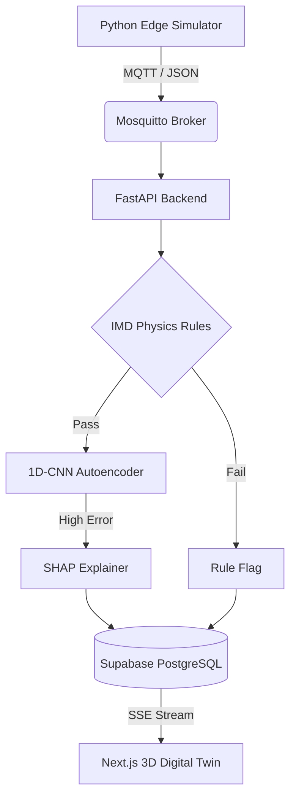
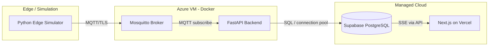
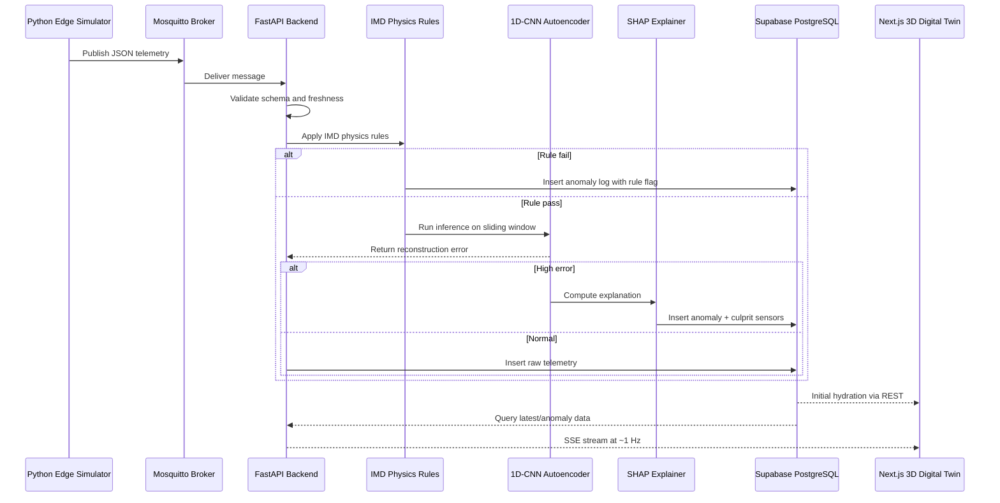
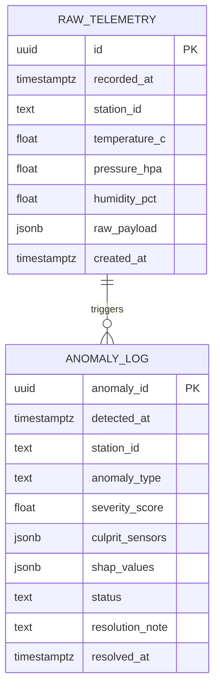

# End-to-End System Architecture

> A purpose-built, free-tier-friendly architecture for demonstrating real-time environmental telemetry, physics-based validation, AI anomaly detection, explainability, and a clickable 3D digital twin.

---

## 1. Executive Summary

This system ingests synthetic environmental telemetry from a Python edge simulator, routes it through MQTT, validates it against IMD-inspired physics rules, runs a 1D-CNN autoencoder to detect deviations from learned normal behavior, explains high-error anomalies with SHAP, stores telemetry and anomaly logs in Supabase PostgreSQL, and streams updates to a Next.js 3D digital twin via Server-Sent Events.

The architecture is optimized for:

- **Live demo impact** — non-technical judges can click a 3D station and immediately see sensor status, anomaly severity, and culprit sensors.
- **Technical depth** — combines MQTT, FastAPI, physics rules, deep learning, explainable AI, PostgreSQL time-series storage, SSE, and React Three Fiber.
- **Zero/low cost** — Python simulation, Dockerized Mosquitto, FastAPI on a friend’s Azure VM, Supabase free tier, and Vercel hobby deployment.
- **Competitive internship signal** — demonstrates end-to-end system design, real-time data engineering, ML deployment, and frontend visualization.

---

## 2. High-Level Architecture



### Simplified Deployment View



---

## 3. Component Responsibilities

| Component | Technology | Responsibility | Free-Tier / Deployment Note |
|---|---|---|---|
| Edge Simulator | Python, `paho-mqtt`, `numpy` | Generates synthetic temperature, pressure, humidity, and fault scenarios; publishes JSON over MQTT | Zero cost; highly flexible for injecting specific faults during demos |
| Message Broker | Eclipse Mosquitto | Routes real-time telemetry efficiently between simulator and backend | Lightweight Docker container on Azure VM using friend’s free credits |
| Backend API | FastAPI, Pydantic, `asyncio` | Subscribes to MQTT, validates payloads, applies IMD physics rules, runs ML inference, writes to Supabase, exposes REST + SSE | Hosted on Azure VM to bypass serverless cold-start latency |
| Physics Rule Engine | Python rule functions | Rejects physically impossible or suspicious readings before ML inference | Lightweight, deterministic, easy to explain to judges |
| Anomaly Model | 1D-CNN Autoencoder | Learns normal temporal patterns; flags high reconstruction error | Small model suitable for CPU inference on the Azure VM |
| Explainability | SHAP | Identifies which sensors/time steps contributed most to an anomaly | Runs only on high-error events to reduce compute cost |
| Database | Supabase PostgreSQL | Stores rolling 7-day telemetry history and anomaly logs | Robust PostgreSQL capabilities, time-series management, free for MVP |
| Streaming | Server-Sent Events | Pushes new sensor packets and anomaly events to the UI at ~1 Hz | Simple unidirectional real-time stream; works well with Next.js |
| Frontend | Next.js, React Three Fiber, Drei | Renders clickable 3D digital twin, station panels, anomaly timeline, live updates | Vercel optimized for React Three Fiber and procedural 3D elements |

---

## 4. Data Pipeline Flow

### 4.1 Simulated Edge

A Python script generates synthetic environmental data and publishes JSON payloads via MQTT.

Example simulated fields:

- Station ID
- Timestamp
- Temperature in °C
- Pressure in hPa
- Humidity in %
- Optional fault-injection flags

Fault scenarios for demo:

- Heat spike
- Sudden pressure drop
- Humidity sensor stuck at 100%
- Gradual drift
- Cross-sensor inconsistency
- Missing data / stale sensor

### 4.2 Message Broker

Eclipse Mosquitto routes real-time telemetry efficiently.

Recommended topic structure:

```text
smartcity/telemetry/v1/{station_id}/raw
smartcity/telemetry/v1/{station_id}/status
smartcity/anomaly/v1/{station_id}
```

Example MQTT payload:

```json
{
  "station_id": "AGRA-01",
  "timestamp": "2026-09-16T10:00:00Z",
  "temperature_c": 34.2,
  "pressure_hpa": 1004.7,
  "humidity_pct": 61.3,
  "source": "edge-simulator",
  "sequence": 1042
}
```

### 4.3 Processing Engine

FastAPI applies strict IMD physics rules before running the 1D-CNN autoencoder to identify deviations from learned normal behavior.

Processing steps:

1. Receive MQTT message.
2. Validate JSON schema with Pydantic.
3. Check timestamp freshness and sequence continuity.
4. Apply IMD physics rules.
5. If rule fails → write rule flag anomaly.
6. If rule passes → push reading into sliding window.
7. Run 1D-CNN autoencoder inference.
8. If reconstruction error exceeds threshold → run SHAP.
9. Write telemetry and/or anomaly records to Supabase.
10. Publish update to SSE stream.

### 4.4 Storage Integration

Supabase stores a rolling 7-day history of telemetry and logs flagged anomalies.

Recommended retention strategy:

- Raw telemetry: 7 days.
- Anomaly logs: 30–90 days or until manually resolved.
- Aggregated hourly summaries: optional, longer retention.
- Use `pg_cron` or a scheduled FastAPI job to delete telemetry older than 7 days.

### 4.5 Interactive UI

The Next.js frontend visualizes the 3D clickable digital twin and receives real-time updates via Server-Sent Events.

UI capabilities:

- 3D map of stations.
- Clickable station nodes.
- Color-coded status: green = normal, amber = warning, red = anomaly.
- Live sensor panel: temperature, pressure, humidity.
- Anomaly detail panel: severity, type, culprit sensors, SHAP explanation.
- Operator actions: acknowledge, resolve, annotate.
- Timeline view of recent anomalies.

### 4.6 End-to-End Sequence



---

## 5. Detection Logic

### 5.1 IMD Physics Rules

These rules are deterministic guards that reject physically impossible or highly suspicious readings before ML inference. They are illustrative and should be tuned to local calibration and sensor specifications.

| Rule | Example Condition | Action |
|---|---|---|
| Temperature range | `-10°C <= temperature <= 60°C` | Fail if outside range |
| Pressure range | `850 hPa <= pressure <= 1100 hPa` | Fail if outside range |
| Humidity range | `0% <= humidity <= 100%` | Fail if outside range |
| Dew point sanity | `dew_point <= temperature` | Fail if violated |
| Rate of change | `abs(temp_delta) <= 5°C/min` | Warn/fail if exceeded |
| Cross-sensor consistency | Heat spike + pressure drop + humidity rise | Flag as compound anomaly |
| Stale data | `now - timestamp > 30s` | Flag stale sensor |
| Sequence gap | `sequence != previous + 1` | Flag dropped packets |
| Flatline | Same humidity for > 10 minutes | Flag stuck sensor |

### 5.2 1D-CNN Autoencoder

The autoencoder learns normal temporal behavior from historical telemetry windows.

Recommended design:

- Input: sliding window of 60 samples.
- Channels: temperature, pressure, humidity.
- Encoder: 1D convolution + pooling + latent vector.
- Decoder: upsampling + 1D convolution + reconstruction.
- Loss: mean squared error.
- Threshold: `mean + k * std` on validation reconstruction errors.
- High error → anomaly candidate.

Why 1D-CNN:

- Captures local temporal patterns.
- Lightweight enough for CPU inference.
- Works well with multivariate sensor streams.
- Easy to explain to judges as “learned normal behavior.”

### 5.3 SHAP Explainer

When reconstruction error is high, SHAP explains which sensors and time steps contributed most.

Outputs:

- Top culprit sensors.
- Contribution magnitude per sensor.
- Time-step importance.
- Human-readable explanation for the UI.

Example UI text:

> “Anomaly detected at AGRA-01. Primary contributor: temperature spike at 10:14:22. Secondary contributor: pressure drop at 10:14:25.”

### 5.4 Decision Matrix

| Rule Result | Autoencoder Error | SHAP | Final Status |
|---|---|---|---|
| Pass | Low | Not run | Normal |
| Pass | High | Run | AI anomaly |
| Fail | Not run | Not run | Rule flag |
| Fail | High | Run | Compound anomaly |
| Stale / missing | Not run | Not run | Sensor health warning |

---

## 6. Data Contracts

### 6.1 Database Schema



#### Raw Telemetry Table

| Column | Type | Notes |
|---|---|---|
| `id` | `uuid` | Primary key |
| `recorded_at` | `timestamptz` | Sensor timestamp |
| `station_id` | `text` | e.g., `AGRA-01` |
| `temperature_c` | `float` | Temperature in Celsius |
| `pressure_hpa` | `float` | Pressure in hPa |
| `humidity_pct` | `float` | Relative humidity |
| `raw_payload` | `jsonb` | Original MQTT payload |
| `created_at` | `timestamptz` | Insert time |

#### Anomaly Log Table

| Column | Type | Notes |
|---|---|---|
| `anomaly_id` | `uuid` | Primary key |
| `detected_at` | `timestamptz` | Detection time |
| `station_id` | `text` | Station reference |
| `anomaly_type` | `text` | `rule_flag`, `ai_anomaly`, `compound` |
| `severity_score` | `float` | 0.0–1.0 |
| `culprit_sensors` | `jsonb` | e.g., `["temperature", "pressure"]` |
| `shap_values` | `jsonb` | SHAP explanation |
| `status` | `text` | `open`, `acknowledged`, `resolved` |
| `resolution_note` | `text` | Operator note |
| `resolved_at` | `timestamptz` | Resolution time |

### 6.2 REST API Contracts

#### Hydration Endpoint

```http
GET /api/v1/telemetry/latest?station_id=AGRA-01&limit=100
```

Loads the initial dashboard state.

Example response:

```json
{
  "station_id": "AGRA-01",
  "latest": {
    "timestamp": "2026-09-16T10:00:00Z",
    "temperature_c": 34.2,
    "pressure_hpa": 1004.7,
    "humidity_pct": 61.3
  },
  "history": [
    {
      "timestamp": "2026-09-16T09:59:59Z",
      "temperature_c": 34.1,
      "pressure_hpa": 1004.8,
      "humidity_pct": 61.2
    }
  ]
}
```

#### Streaming Endpoint

```http
GET /api/v1/telemetry/stream?station_id=AGRA-01
Content-Type: text/event-stream
```

A continuous SSE connection pushes new sensor packets to the UI at 1 Hz.

Example SSE events:

```text
event: telemetry
id: 1726492800000
data: {"station_id":"AGRA-01","timestamp":"2026-09-16T10:00:00Z","temperature_c":34.2,"pressure_hpa":1004.7,"humidity_pct":61.3}

event: anomaly
id: 1726492801000
data: {"anomaly_id":"a1b2c3","station_id":"AGRA-01","anomaly_type":"ai_anomaly","severity_score":0.91,"culprit_sensors":["temperature","pressure"]}

event: heartbeat
data: {"status":"ok","timestamp":"2026-09-16T10:00:01Z"}
```

#### Anomaly Management Endpoints

```http
GET /api/v1/anomalies?status=open&limit=50
PATCH /api/v1/anomalies/{anomaly_id}
```

Example PATCH body:

```json
{
  "status": "resolved",
  "resolution_note": "Maintenance team recalibrated temperature sensor."
}
```

---

## 7. Frontend: Next.js 3D Digital Twin

### Core Stack

- Next.js App Router
- React Three Fiber
- Drei
- Tailwind CSS
- Zustand or React Query for state
- EventSource for SSE

### 3D Digital Twin Features

- Procedurally generated city/station layout.
- Clickable station meshes.
- Hover tooltips with live readings.
- Color states:
  - Green: normal
  - Amber: warning
  - Red: anomaly
- Camera controls: orbit, zoom, reset.
- Anomaly pulse animation.
- Side panel with sensor charts and SHAP explanation.
- Operator resolution workflow.

### Real-Time Update Strategy

1. On page load, call `/api/v1/telemetry/latest`.
2. Open SSE connection to `/api/v1/telemetry/stream`.
3. Update Zustand store on each `telemetry` event.
4. On `anomaly` event, trigger 3D pulse and open anomaly panel.
5. Reconnect automatically with exponential backoff if SSE drops.

---

## 8. Free-Tier Tech Stack Justification

| Layer | Choice | Justification |
|---|---|---|
| Edge Simulation | Python | Zero cost and highly flexible for injecting specific faults during live demonstrations |
| Cloud Messaging | Mosquitto | Lightweight Docker container on a friend’s Azure VM maximizes free credits |
| Backend API | FastAPI | Hosting on the Azure VM completely bypasses serverless cold-start latency issues |
| Database | Supabase | Robust PostgreSQL capabilities with easy time-series management and no cost for the MVP |
| Frontend | Next.js / Vercel | Optimized for React Three Fiber, ensuring procedural 3D elements render flawlessly in the browser |
| Streaming | SSE | Simpler than WebSockets for unidirectional live updates; works well through proxies and Vercel |
| Explainability | SHAP | Runs only on high-error events, keeping compute cost low |

---

## 9. Deployment Topology

### Azure VM Docker Compose

```yaml
version: "3.9"

services:
  mosquitto:
    image: eclipse-mosquitto:2
    ports:
      - "1883:1883"
      - "8883:8883"
    volumes:
      - ./mosquitto/config:/mosquitto/config
      - ./mosquitto/data:/mosquitto/data
      - ./mosquitto/log:/mosquitto/log
    restart: unless-stopped

  fastapi:
    build: ./backend
    ports:
      - "8000:8000"
    environment:
      - MQTT_BROKER=mosquitto
      - MQTT_PORT=1883
      - SUPABASE_URL=${SUPABASE_URL}
      - SUPABASE_SERVICE_KEY=${SUPABASE_SERVICE_KEY}
      - MODEL_PATH=/app/models/autoencoder.pt
    depends_on:
      - mosquitto
    restart: unless-stopped
```

### Environment Variables

```text
MQTT_BROKER=mosquitto
MQTT_PORT=1883
MQTT_USERNAME=smartcity
MQTT_PASSWORD=change-me

SUPABASE_URL=https://your-project.supabase.co
SUPABASE_SERVICE_KEY=your-service-role-key

MODEL_PATH=/app/models/autoencoder.pt
ANOMALY_THRESHOLD=0.042

CORS_ORIGINS=https://your-app.vercel.app
```

---

## 10. Security, Reliability, and Observability

### Security

- MQTT username/password + TLS on port 8883.
- Topic ACLs to restrict publishers/subscribers.
- FastAPI API key or JWT for write endpoints.
- CORS restricted to the Vercel domain.
- Supabase Row Level Security enabled.
- Service role key only on backend, never in frontend.
- Pydantic validation for all incoming payloads.
- Rate limiting on public endpoints.

### Reliability

- Mosquitto healthcheck and restart policy.
- FastAPI `/health` and `/ready` endpoints.
- SSE reconnect with exponential backoff.
- Database connection pooling.
- Dead-letter queue for malformed MQTT messages.
- Graceful degradation: if ML model fails, fall back to rule-only detection.

### Observability

- Structured JSON logs.
- Metrics:
  - Messages/second
  - Rule failure rate
  - Autoencoder error distribution
  - SSE connected clients
  - Database write latency
- Alerting thresholds for:
  - Broker down
  - API down
  - DB write failures
  - Anomaly spike

---

## 11. Demo Narrative

1. Start the Python edge simulator, Mosquitto, FastAPI, and Next.js frontend.
2. Show the 3D digital twin with all stations green.
3. Inject a heat spike from the simulator.
4. FastAPI rules pass if within range, but the 1D-CNN autoencoder detects high reconstruction error.
5. SHAP identifies temperature as the primary culprit.
6. The 3D station turns red and pulses.
7. Click the station to show live readings, anomaly severity, and SHAP explanation.
8. Inject a pressure drop to demonstrate a compound anomaly.
9. Resolve the anomaly from the UI.
10. Show the anomaly log status changing to `resolved`.

---

## 12. Future Enhancements

- Integrate real sensors via LoRaWAN or MQTT gateways.
- Add edge inference on Raspberry Pi or Jetson Nano.
- Implement automated model retraining pipeline.
- Add user authentication and role-based access.
- Support multiple cities and tenant isolation.
- Add SMS/email alerting via Twilio or Resend.
- Import real GIS/city models for the 3D twin.
- Add historical playback and time-travel debugging.
- Use Supabase Realtime as an alternative to SSE.
- Add Prometheus + Grafana dashboards.

---

## 13. Summary

This 3D clickable digital twin architecture is purpose-built to impress non-technical judges at events like the Agra Smart City Shark Tank, while providing the technical depth needed to secure a competitive AI development internship. It demonstrates real-time data ingestion, physics-based validation, deep learning anomaly detection, explainable AI, cloud storage, and an interactive 3D frontend — all within a free-tier-friendly stack.